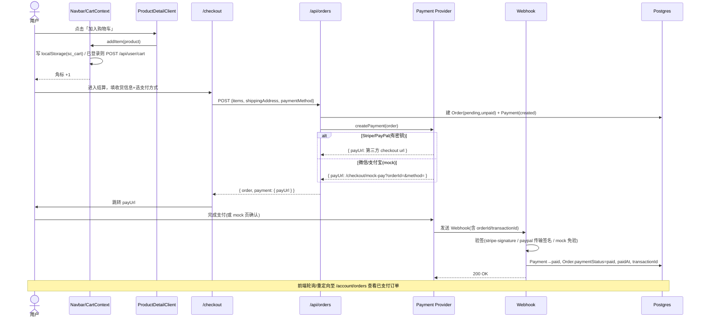
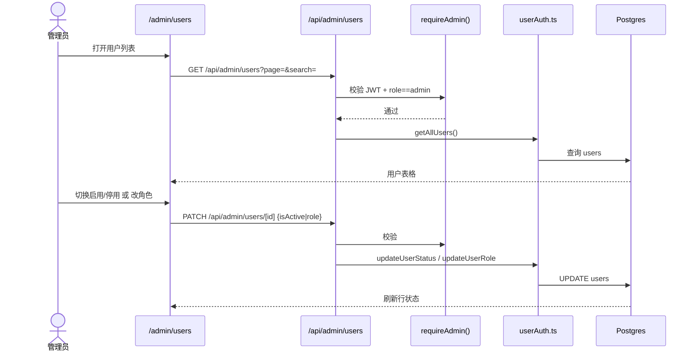
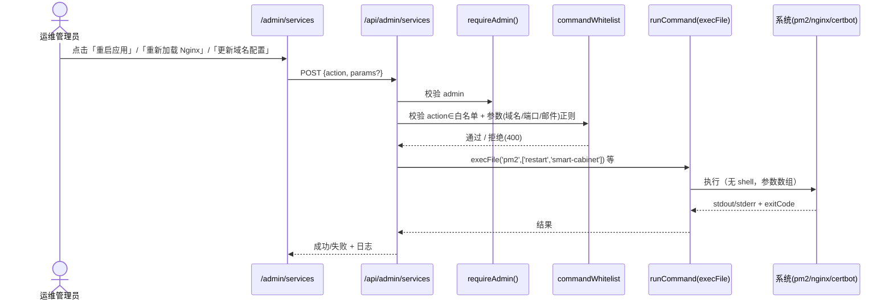
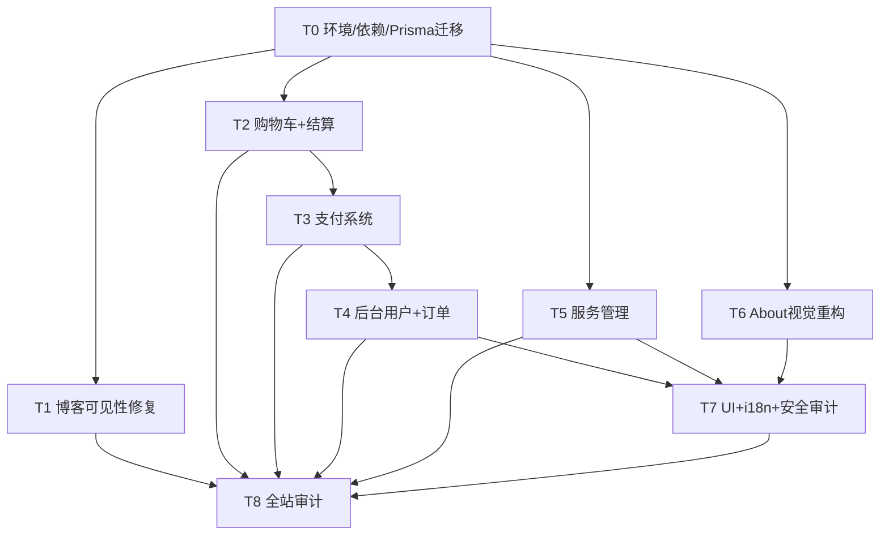

# ARCHITECTURE-V8：smart-cabinet 系统架构设计 + 任务分解

> 作者：Bob（Architect） ｜ 版本：V8 ｜ 日期：2026-07
> 配套 PRD：`docs/PRD-V8.md`（产品经理 Alice）
> 主理人已裁决 7 项待确认问题（Q1–Q7），本文严格遵循。

---

## 0. 关键代码事实（已实际核对，作为设计依据）

| # | 事实 | 证据文件 | 设计影响 |
| --- | --- | --- | --- |
| F1 | 数据库实为 **PostgreSQL**（`datasource db { provider = "postgresql" }`），非 PRD 背景写的 MySQL/SQLite | `prisma/schema.prisma:5-8` | 迁移按 Postgres 写；若部署需换库需另行评估（非本次范围） |
| F2 | 博客列表/详情 API **仅读 DB**；静态 16 条在 `src/data/blogs.ts`，其中 2 篇 V7 新文未被列表返回 | `src/app/api/blogs/route.ts:18`、`src/app/api/blogs/[slug]/route.ts:22`、`src/data/blogs.ts` | V8-001 必须合并双源 |
| F3 | 后台登录只写**常量 cookie** `admin_auth=authenticated`；`verifyAuth()` 仅判断 token「是否存在」，**不校验签名/角色** | `src/app/api/admin/login/route.ts:16-24`、`src/lib/auth.ts:8-32` | V8-007 必须改为签名 JWT + 角色校验 |
| F4 | 前端 `lib/api.ts` 的 `getAuthToken()` 读取 localStorage `admin_token`（登录时写入伪值 `'authenticated-'+Date.now()`） | `src/lib/api.ts:220-224`、`src/app/admin/login/page.tsx:38` | 登录须写真实 JWT，保证 Bearer 与 cookie 双通道可用 |
| F5 | `Order` 无支付字段；`/api/orders` 创建订单仅 `status:'pending'` | `prisma/schema.prisma:225`、`src/app/api/orders/route.ts:78` | 扩展 Order + 新增 Payment |
| F6 | `User` 无 cart 字段；`/api/user/cart` 不存在；全仓无 cart 代码 | `prisma/schema.prisma:187`、`grep cart` 无结果 | 新增 User.cart（JSON）+ cart API |
| F7 | admin / xiaozhouBackend 导航**硬编码中文**且无 users/orders/services 入口；两套 layout 近 600 行高度重复 | `src/app/admin/layout.tsx:88-98`、`src/app/xiaozhouBackend/layout.tsx:88-98` | 抽共享 AdminShell + admin i18n |
| F8 | i18n 用 `src/messages/{en,zh,ar}.json`（454 键，flat 点号）；`t(key)` 缺失时**原样返回 key**；根 `messages/` 为孤儿目录 | `src/lib/i18n.tsx:23-40`、`messages/` | V8-006 / V8-016 校验+清理 |
| F9 | 博客封面图通过 `SLUG_TO_IMAGE` 映射；V7 两篇图 `/images/blog/vending-machine-trends-2026.jpg`、`cnc-tool-inventory-guide.jpg` 可能缺失（CSS 背景，缺失即空白，不报错） | `src/app/[locale]/blog/page.tsx:122-125` | Q7 生成占位图 |
| F10 | 服务管理无任何代码；nginx 配置 `nginx-conf.d-smart-cabinet.conf` 与部署脚本 `deploy-v*.sh` 仅文件 | 目录扫描 | Q2 方案 C：命令白名单 + 可视化 |

---

## 1. 实现方案概述

整体技术路线：**Next.js App Router 单仓双前台（官网 `[locale]` + 后台 `admin`/`xiaozhouBackend`）+ Prisma/Postgres + 前端 CartContext + 服务端支付/服务编排**。坚持「可落地、可批量化实现」，不堆抽象。

### 1.1 前端
- **购物车**：`CartContext`（React Context）管理内存态，未登录写入 `localStorage`（key `sc_cart`）；登录后调用 `/api/user/cart` 合并到 `User.cart`。`Navbar` 增加购物车角标 + 抽屉。
- **结算**：`/[locale]/checkout` 单页（client component），填写收货信息、选择支付方式，提交至 `/api/orders`。
- **支付跳转**：Stripe/PayPal 返回第三方 URL 直接跳转；微信/支付宝返回内部 mock 支付页 `/checkout/mock-pay`，确认后回写。
- **后台**：admin 与 xiaozhouBackend 共用一套 `AdminShell` 布局组件（消除 600 行重复），新增 users / orders / services 导航项。

### 1.2 后端 API（Next Route Handlers）
- 博客：新增 `src/lib/blogs.ts` 合并层，供 list/detail API 复用（单一事实来源，满足 Q5）。
- 订单/支付：`/api/orders` 创建订单 + Payment 记录并返回支付链接；`/api/payments/{stripe,paypal,wechat,alipay}/*` 发起与回调。
- 服务管理：`/api/admin/services` 仅执行**命令白名单**（child_process `execFile`，无 shell 注入），参数严格校验。
- 鉴权：`requireAdmin(request)` 校验**签名 JWT + role==='admin'`，替换现有仅判存无的 `verifyAuth`。

### 1.3 支付（Q1）
- **海外（Stripe + PayPal）**：真实 SDK + env 密钥 + Webhook 验签后更新 `Order.paymentStatus='paid'`、`paidAt`、`transactionId`。缺密钥时自动降级 mock，保证 dev 可跑。
- **国内（微信/支付宝）**：先搭完整框架（service 层 + 路由 + mock 支付页），无商户密钥走 **mock/sandbox** 模式返回模拟支付链接/回调，代码结构留好真实 SDK 接入点（注释标明）。

### 1.4 服务管理（Q2，方案 C）
- 后台「服务管理」页可视化操作；后端按**命令白名单**执行：`pm2 restart smart-cabinet`、`nginx -t && nginx -s reload`、`certbot renew`、写入 nginx 配置（域名/端口/邮件，校验后写固定文件）、一键恢复默认配置。
- 全部使用 `execFile` 传参数组（不经过 shell）；域名/端口/邮件经正则校验；可写文件路径锁死在白名单内。

### 1.5 角色与权限（Q4）
- 维持 `user` / `admin` 两角色；新增客户端 `isAdmin()` 工具 + 服务端 `requireAdmin()`。User 模型 `role` 字段保留字符串，预留扩展位。

### 1.6 博客（Q5）
- 立刻修：列表/详情 API 一致合并 静态(`src/data/blogs.ts`) + DB。
- 长期（V8-014，可选）：Prisma seed 将 16 条静态迁 DB，之后删静态源。本设计把 seed 作为独立可选步骤。

---

## 2. 框架 / 依赖选型

### 2.1 新增运行时依赖
| 包 | 版本 | 用途 | 是否仅 dev |
| --- | --- | --- | --- |
| `stripe` | `^17.0.0` | Stripe Checkout Session 创建 + Webhook 验签 | 否 |
| `@paypal/checkout-server-sdk` | `^1.0.0` | PayPal 订单创建 + Webhook 验签 | 否 |

### 2.2 国内支付（微信/支付宝）
- **本版不引入 SDK**（mock 模式无需）。真实接入时在 `src/lib/payments/wechat.ts`、`alipay.ts` 注释标注推荐包：`wechatpay-node-v3`、`alipay-sdk`，届时加为运行时依赖即可，无需改结构。

### 2.3 占位图生成
- **零依赖**：`scripts/generate-placeholders.mjs` 用 Node 内置 `zlib` 自写最小 PNG 编码器，生成品牌渐变占位图（无文字，卡片上已有分类徽标/标题覆盖）。避免引入 `sharp`/`canvas` 重依赖。

### 2.4 开发/校验脚本
- `scripts/validate-i18n.mjs`（零依赖，Node 内置 `fs`/`path`）：校验 `src/messages/{en,zh,ar}.json` 键集合一致 + 检测疑似未翻译（值等于 key）条目。
- `prisma/seed.ts`：可选，迁移静态博客入 DB（复用现有 `prisma` devDep）。

> 不引入状态管理库（用 React Context 足够）；不引入 UI 新框架（沿用 Tailwind + 现有 `.admin-card` 设计系统）。

---

## 3. 文件列表（按模块分组，标注 新增 / 修改）

### A. 环境与数据层（阶段0）
- `package.json`（修改：加 stripe、@paypal/checkout-server-sdk）
- `prisma/schema.prisma`（修改：Order 加支付字段、新增 Payment 模型、User 加 cart）
- `prisma/migrations/<ts>_v8_commerce/`（新增：migrate dev 生成）
- `.env.example`（修改：补支付/后台 JWT/服务管理相关变量）
- `src/lib/payments/config.ts`（新增：读取 env、判定 mock/real、币种路由）

### B. 博客可见性（阶段1）
- `src/lib/blogs.ts`（**新增**：`getMergedBlogList()`、`getMergedBlogBySlug()`）
- `src/data/blogs.ts`（修改：确保 `export const blogs` 被导出）
- `src/app/api/blogs/route.ts`（修改：GET 改调合并层）
- `src/app/api/blogs/[slug]/route.ts`（修改：GET 改调合并层）
- `src/app/[locale]/blog/[slug]/page.tsx`（修改：改读合并后 API，去掉前端重复合并）
- `scripts/generate-placeholders.mjs`（新增）
- `public/images/blog/vending-machine-trends-2026.jpg`、`public/images/blog/cnc-tool-inventory-guide.jpg`（新增：脚本生成）

### C. 购物车 + 结算（阶段2）
- `src/context/CartContext.tsx`（新增：Provider + useCart）
- `src/lib/cart.ts`（新增：合并/归一化购物车工具）
- `src/components/cart/CartButton.tsx`（新增：角标按钮）
- `src/components/cart/CartDrawer.tsx`（新增：抽屉列表/改数量/删除/去结算）
- `src/components/layout/Navbar.tsx`（修改：集成 CartButton）
- `src/components/products/ProductDetailClient.tsx`（修改：加「加入购物车」）
- `src/app/[locale]/products/page.tsx`（修改：列表卡片快捷加购，可选）
- `src/app/[locale]/checkout/page.tsx`（新增：结算表单 + 支付路由）
- `src/app/api/user/cart/route.ts`（新增：GET 取用户购物车 / POST 合并保存）

### D. 支付系统（阶段3）
- `src/lib/payments/types.ts`（新增：PaymentMethod、Provider 接口、入参/出参）
- `src/lib/payments/stripe.ts`（新增）
- `src/lib/payments/paypal.ts`（新增）
- `src/lib/payments/wechat.ts`（新增：mock 框架）
- `src/lib/payments/alipay.ts`（新增：mock 框架）
- `src/lib/payments/index.ts`（新增：工厂 `getProvider(method)`）
- `src/app/api/payments/stripe/create-session/route.ts`（新增）
- `src/app/api/payments/stripe/webhook/route.ts`（新增）
- `src/app/api/payments/paypal/create-order/route.ts`（新增）
- `src/app/api/payments/paypal/webhook/route.ts`（新增）
- `src/app/api/payments/wechat/create/route.ts`（新增）
- `src/app/api/payments/wechat/callback/route.ts`（新增：mock 回写）
- `src/app/api/payments/alipay/create/route.ts`（新增）
- `src/app/api/payments/alipay/callback/route.ts`（新增：mock 回写）
- `src/app/api/orders/route.ts`（修改：接收 paymentMethod、建 Payment、返回 payUrl）
- `src/app/[locale]/checkout/mock-pay/page.tsx`（新增：微信/支付宝 mock 支付确认页）

### E. 后台用户 + 订单（阶段4）
- `src/app/admin/users/page.tsx`（新增）
- `src/app/xiaozhouBackend/users/page.tsx`（新增）
- `src/app/admin/orders/page.tsx`（新增）
- `src/app/xiaozhouBackend/orders/page.tsx`（新增）
- `src/lib/admin/orders.ts`（新增：列表/筛选/改状态服务）
- `src/app/api/admin/orders/route.ts`（新增：GET 列表+筛选）
- `src/app/api/admin/orders/[id]/route.ts`（新增：GET / PATCH 改状态/备注）
- `src/lib/admin/users.ts`（新增：封装现有 userAuth，便于页面复用）
- （users API 已存在 `src/app/api/admin/users/*`，本阶段直接复用，仅需页面）

### F. 服务管理（阶段5）
- `src/lib/services/commandWhitelist.ts`（新增：动作枚举 + 参数校验）
- `src/lib/services/runCommand.ts`（新增：`execFile` 安全封装）
- `src/lib/services/nginxConfig.ts`（新增：按 SiteSettings 生成 nginx conf）
- `src/app/api/admin/services/route.ts`（新增：POST 执行白名单动作）
- `src/app/admin/services/page.tsx`（新增）
- `nginx-conf.d-smart-cabinet.conf`（修改：作为模板，含 `__DOMAIN__/__PORT__` 占位）

### G. About 视觉重构（阶段6）
- `src/app/[locale]/about/page.tsx`（修改：图片高度≥600px、`clamp()` 字号、真实翻书、客户质感卡片）
- `src/components/about/CompanyShowcase.tsx`（新增：抽离工厂/公司展示区）
- `src/components/about/ValuesBook.tsx`（新增：双页真实翻书组件）
- `src/components/about/ClientWall.tsx`（新增：质感客户卡片墙，灰度→悬停彩色，RTL 适配）

### H. 后台 UI 现代化 + 共享壳（阶段7 / 阶段8 交叉）
- `src/components/admin/AdminShell.tsx`（新增：共享后台布局，抽离原 admin/xiaozhouBackend layout 的重复样式与结构）
- `src/app/admin/layout.tsx`（修改：改用 AdminShell + 新增导航项 + admin i18n）
- `src/app/xiaozhouBackend/layout.tsx`（修改：同上）

### I. i18n 校验 + 安全审计（阶段8）
- `scripts/validate-i18n.mjs`（新增）
- `src/messages/admin.en.json`、`admin.zh.json`、`admin.ar.json`（新增）
- `src/lib/admin-i18n.ts`（新增：加载 admin 三语文案）
- `src/lib/auth.ts`（修改：`requireAdmin()` 校验签名+角色；保留 `verifyAuth` 兼容或替换）
- `src/lib/auth/jwt.ts`（修改/新增：`generateAdminToken()`）
- `src/app/api/admin/login/route.ts`（修改：签发真实 JWT cookie + 返回 token）
- `src/lib/api.ts`（修改：`getAuthToken()` 读真实 token）
- `src/app/api/admin/**/*.ts`（修改：统一改用 `requireAdmin`）
- `src/messages/en.json`、`zh.json`、`ar.json`（修改：补缺失键、修 ar RTL/误译）
- 根 `messages/`（删除：V8-016 清理孤儿目录，确认无引用后移除）

### J. 全站审计（阶段9）
- `docs/AUDIT-V8.md`（新增：缺陷/隐患/显示问题清单 + 修复记录）

---

## 4. 数据模型变更（Prisma）

> 仅展示变更片段；其余模型（Product/Category/BlogPost 等）不动。

```prisma
// ===== User：新增购物车（JSON，沿用 shippingAddress 既有模式，Q3）=====
model User {
  // ... 既有字段 ...
  cart Json? // [{ productId: String, quantity: Int, price: Float, name: Json, image: String? }]
  // 既有 relations 保持
}

// ===== Order：扩展支付字段（Q1/Q4）=====
model Order {
  id              String   @id @default(cuid())
  userId          String
  status          String   @default("pending") // 履约态: pending/processing/shipped/delivered/cancelled
  total           Float
  shippingAddress Json?
  // —— 新增支付字段 ——
  paymentMethod   String?  // 'stripe' | 'paypal' | 'wechat' | 'alipay'
  paymentStatus   String   @default("unpaid") // unpaid|pending|paid|failed|refunded
  transactionId   String?
  paidAt          DateTime?
  // —— 结束新增 ——
  createdAt       DateTime @default(now())
  updatedAt       DateTime @updatedAt

  user    User     @relation(fields: [userId], references: [id], onDelete: Cascade)
  items   OrderItem[]
  payment Payment? // 新增关联
  @@index([userId, status])
  @@index([createdAt])
  @@map("orders")
}

// ===== Payment：新增，支付流水 + Webhook 幂等（Q1）=====
model Payment {
  id            String   @id @default(cuid())
  orderId       String
  method        String   // stripe|paypal|wechat|alipay
  status        String   @default("created") // created|pending|paid|failed
  amount        Float
  currency      String   @default("USD")
  transactionId String?
  rawPayload    Json?    // Webhook 原始负载（脱敏后存，便于对账）
  createdAt     DateTime @default(now())
  updatedAt     DateTime @updatedAt

  order Order @relation(fields: [orderId], references: [id], onDelete: Cascade)
  @@unique([method, transactionId]) // Webhook 幂等：同渠道同交易号只处理一次
  @@index([orderId])
  @@map("payments")
}
```

> **设计取舍**：购物车用 `User.cart`（JSON）而非独立 Cart 表 —— 与既有 `shippingAddress Json?` 模式一致，迁移成本最低；游客态走 localStorage，登录合并。若未来需多设备同步再升级为表。
> **Payment 独立模型**而非仅 Order 字段 —— 支持 Webhook 重试幂等、多渠道对账、退款记录，避免订单表膨胀。

---

## 5. 程序调用流程（时序图）

### 5.1 加购 → 结算 → 支付 → 回调


### 5.2 后台用户管理


### 5.3 后台服务管理执行（Q2 方案 C）


---

## 6. 任务列表（分阶段，按实现顺序，含依赖 + 验收）

> 每个任务为「同模块文件批量写」单元；依赖指必须在其后启动的任务。验收标准供工程师自测与测试同学核对。

### T0 — 阶段0：环境 / 依赖 / Prisma 迁移【P0 地基】
- **涉及文件**：`package.json`、`prisma/schema.prisma`、`.env.example`、`src/lib/payments/config.ts`
- **依赖**：无
- **验收**：
  1. `npm install` 成功，`stripe` / `@paypal/checkout-server-sdk` 进 `dependencies`。
  2. `npx prisma migrate dev --name v8_commerce` 成功，DB 出现 `paymentStatus` 等列与 `payments` 表、`users.cart` 列。
  3. `.env.example` 含全部新增变量（见 §7）。
  4. `config.ts` 能按 env 正确返回 `mock=true/false` 与币种。

### T1 — 阶段1：博客可见性修复【P0 快速止血】
- **涉及文件**：`src/lib/blogs.ts`、`src/data/blogs.ts`(export)、`src/app/api/blogs/route.ts`、`src/app/api/blogs/[slug]/route.ts`、`src/app/[locale]/blog/[slug]/page.tsx`、`scripts/generate-placeholders.mjs`、`public/images/blog/*.jpg`
- **依赖**：T0
- **验收**：
  1. 列表页能展示 16 条（含 V7 两篇 `industrial-vending-machine-trends-2026`、`cnc-tool-inventory-management-guide`）。
  2. 详情页 slug 命中静态或 DB 均可打开，不重复合并。
  3. 两篇封面占位图生成且 `SLUG_TO_IMAGE` 指向文件存在（background 不再空白）。
  4. `node scripts/generate-placeholders.mjs` 幂等可重跑。

### T2 — 阶段2：购物车 + 结算（前端）【P0】
- **涉及文件**：`src/context/CartContext.tsx`、`src/lib/cart.ts`、`src/components/cart/*`、`src/components/layout/Navbar.tsx`、`src/components/products/ProductDetailClient.tsx`、`src/app/[locale]/products/page.tsx`、`src/app/[locale]/checkout/page.tsx`、`src/app/api/user/cart/route.ts`
- **依赖**：T0
- **验收**：
  1. 游客加购 → `localStorage.sc_cart` 有数据，Navbar 角标正确。
  2. 登录后 `/api/user/cart` 合并游客态到 `User.cart`，多端一致。
  3. 结算页提交 `/api/orders` 创建 pending 订单并返回 payUrl（此时 payment 用 mock 也能跑通整链）。
  4. 空购物车/未登录跳结算有正确引导。

### T3 — 阶段3：支付系统（Stripe/PayPal 海外 + 微信/支付宝框架）【P0/P1】
- **涉及文件**：`src/lib/payments/*`、`src/app/api/payments/**`、`src/app/api/orders/route.ts`、`src/app/[locale]/checkout/mock-pay/page.tsx`
- **依赖**：T2
- **验收**：
  1. Stripe：`create-session` 返回 checkout URL；Webhook 验签后 `Order.paymentStatus='paid'`、`paidAt`、`transactionId` 写入；重复 Webhook 幂等。
  2. PayPal：同理，返回 approve URL + Webhook 更新。
  3. 微信/支付宝：`create` 返回内部 mock 支付页 URL；mock 页确认后 callback 将订单置 paid（结构留好真实 SDK 接入注释）。
  4. 缺 env 密钥时自动 mock，dev 全流程可走通；生产缺密钥明确报错不静默。
  5. 用同一 `getProvider(method)` 工厂，四渠道接口一致。

### T4 — 阶段4：后台用户管理 + 订单管理【P0/P1】
- **涉及文件**：`src/app/admin/users/page.tsx`、`src/app/xiaozhouBackend/users/page.tsx`、`src/app/admin/orders/page.tsx`、`src/app/xiaozhouBackend/orders/page.tsx`、`src/lib/admin/users.ts`、`src/lib/admin/orders.ts`、`src/app/api/admin/orders/route.ts`、`src/app/api/admin/orders/[id]/route.ts`
- **依赖**：T0（用户 API 已存在，订单 API 依赖 T3 的支付字段）
- **验收**：
  1. 两个后台均有 users 页：列表/搜索、启用停用、角色切换（user/admin）、删除。
  2. 两个后台均有 orders 页：列表+状态筛选、详情、改履约状态（pending→processing→shipped→delivered/cancelled）、备注。
  3. 订单页展示 `paymentMethod`/`paymentStatus`/`paidAt`。
  4. 复用既有 `/api/admin/users/*`，仅新增 orders API。

### T5 — 阶段5：后台服务管理【P1，Q2】
- **涉及文件**：`src/lib/services/*`、`src/app/api/admin/services/route.ts`、`src/app/admin/services/page.tsx`、`nginx-conf.d-smart-cabinet.conf`
- **依赖**：T4（需 requireAdmin，见 T7）
- **验收**：
  1. 页面可触发 5 个白名单动作，返回执行日志。
  2. 任意非白名单 action 或非法参数（坏域名/端口/邮件）被拒（400），后端绝不经 shell 拼接用户输入。
  3. `update-nginx-config` 仅写白名单内固定文件，写后自动 `nginx -t && reload`。
  4. `restore-default-config` 可一键回滚。
  5. 部署文档注明：app 运行用户需对 `nginx -s reload`/`certbot renew` 有受限 sudo（或 root 运行），否则相应动作失败需运维手动。

### T6 — 阶段6：About 三大视觉重构【P1】
- **涉及文件**：`src/app/[locale]/about/page.tsx`、`src/components/about/{CompanyShowcase,ValuesBook,ClientWall}.tsx`
- **依赖**：无（可并行，建议 T0 后）
- **验收**：
  1. 公司/工厂图 `minHeight` ≥ 600px，`object-cover` 不变形；标题改用 `clamp()` 不再硬放大；空洞区有数据动效/认证徽章填充。
  2. `ValuesBook` 为双页真实翻书（书脊/中缝/`rotateY` 阴影/自动+手动翻页），每页内容充实。
  3. `ClientWall` 为质感卡片（客户名+行业+合作年限+信赖标语，灰度→悬停彩色），ar 下 RTL 正确。
  4. 三个区块抽为独立组件，`about/page.tsx` 显著瘦身、可维护。

### T7 — 阶段7+8：后台 UI 现代化 + i18n 校验 + 安全审计【P0/P1】
- **涉及文件**：`src/components/admin/AdminShell.tsx`、`src/app/admin/layout.tsx`、`src/app/xiaozhouBackend/layout.tsx`、`scripts/validate-i18n.mjs`、`src/messages/admin.*.json`、`src/lib/admin-i18n.ts`、`src/lib/auth.ts`、`src/lib/auth/jwt.ts`、`src/app/api/admin/login/route.ts`、`src/lib/api.ts`、`src/app/api/admin/**`、`src/messages/{en,zh,ar}.json`、删除根 `messages/`
- **依赖**：T4、T5（服务/订单页需 AdminShell + requireAdmin）、T6（About 不依赖但同批收尾更稳）
- **验收**：
  1. `requireAdmin()` 校验**签名 JWT + role==='admin'`；旧 `verifyAuth` 全部替换为 `requireAdmin`；伪造 token/cookie 访问 admin API 返回 401。
  2. 登录签发真实 JWT（httpOnly cookie + 返回 token 供 Bearer）；前端 `getAuthToken()` 读真实 token。
  3. admin/xiaozhouBackend 布局合并为 `AdminShell`，导航新增 users/orders/services 且文案走 `admin-i18n`（三语，不再硬编码中文）。
  4. `node scripts/validate-i18n.mjs` 通过：三语键集合一致、无「值==key」残键。
  5. `src/messages/{en,zh,ar}.json` 补缺失键、修 ar RTL/误译；根 `messages/` 删除后全站无引用报错（`npm run build` 通过）。

### T8 — 阶段9：全站审计（缺陷/隐患/显示）【P0/P1/P2 收尾】
- **涉及文件**：`docs/AUDIT-V8.md` + 针对发现的修复改动
- **依赖**：T1–T7
- **验收**：
  1. 产出 `AUDIT-V8.md`：列出构建告警、RTL 异常、XSS/注入点（重点富文本/base64 图）、死链接、后台越权面。
  2. P0/P1 项在本阶段修复或标注 owner；`npm run build` 与 `npm run test:run` 通过。
  3. 与产品经理确认 V8-014（静态博客迁 DB seed）是否本次执行——默认列为可选，不阻塞发布。

> **任务依赖总览**：T0 → {T1, T2, T6}；T2 → T3；T3 → T4(订单字段)；T4,T5 → T7；T1–T7 → T8。
> （注：T6 About 与电商/后台无耦合，可任意阶段并行；此处为清晰起见排在 T5 后。）

---

## 7. 共享知识（跨文件约定）

### 7.1 API 响应格式
- 公开/用户 API：`{ data, total?, page?, pageSize? }` 或 `{ error }`（失败带 `status`）。
- 后台 API（统一）：`{ success: true, ... }` / `{ success: false, error }`。
- 订单/支付：`POST /api/orders` 返回 `{ order, payment: { payUrl, method, transactionId? } }`。

### 7.2 错误处理
- 服务端 Route Handler 统一 `try/catch` → `serverErrorResponse()`（500）。
- 校验失败用 `badRequestResponse(msg)`（400）。
- 客户端 `lib/api.ts` 已约定 `throw new Error(...)`，页面 `try/catch` 展示 toast。

### 7.3 鉴权（关键改造）
- **服务端**：`requireAdmin(request): Promise<JwtPayload | null>`（`src/lib/auth.ts`）——从 `Authorization: Bearer` 或 cookie `admin_auth` 取 token，`verifyToken()` 校验签名且 `role==='admin'`。
- **登录签发**：`generateAdminToken({ sub, username, role:'admin' })`（`src/lib/auth/jwt.ts`，复用 `JWT_SECRET`）。
- **客户端**：`lib/api.ts` 的 `getAuthToken()` 改读 localStorage `admin_token`（= 真实 JWT）；后台页面布局仍用 `admin_authenticated` 仅做 UX 跳转（非安全边界）。
- **用户 JWT**：既有 `/api/auth/*` 的 `generateToken(userId,email,role)` 保持不变；用户态接口用 `verifyToken` + `payload.userId`。

### 7.4 支付回调验签
- Stripe：`stripe.webhooks.constructEvent(rawBody, sig, STRIPE_WEBHOOK_SECRET)`；从 `session.metadata.orderId` 取订单。
- PayPal：用 `PAYPAL_WEBHOOK_ID` + 传输签名头校验（`@paypal/checkout-server-sdk` 的 notification verifier）。
- 微信/支付宝（mock）：`/callback` 免验签，仅接受本系统生成的 `orderId`；真实接入时替换为对应 SDK 验签。
- **幂等**：`Payment` 表 `@@unique([method, transactionId])`；Webhook 先查重，已 paid 直接 200。

### 7.5 i18n 约定
- 前台文案 key 统一在 `src/messages/{en,zh,ar}.json`（flat 点号），`t(key)` 缺失回退英文后再回退 key。
- 后台文案新增 `src/messages/admin.{en,zh,ar}.json`，经 `src/lib/admin-i18n.ts` 加载，禁止硬编码中文。
- 新增 key 须三语同步；`scripts/validate-i18n.mjs` 为 CI/本地校验门禁。
- RTL：`ar` 下根容器加 `dir="rtl"`（现有机制），组件避免硬编码 `left/right`，用 `rtl:` 变体或逻辑属性。

### 7.6 数据库 / 命名
- 模型 JSON 多语字段统一 `{ zh, en, ar }`；购物车/订单项 `name` 存下单时快照（Json）。
- 后台服务命令参数白名单见 §7.7；任何用户输入禁止进入 shell。

### 7.7 服务管理命令白名单（Q2）
- 允许动作：`restart-app`(pm2 restart smart-cabinet)、`reload-nginx`(nginx -t && nginx -s reload)、`renew-ssl`(certbot renew)、`update-nginx-config`(校验后写白名单文件再 reload)、`restore-default-config`(拷模板再 reload)。
- 参数校验：域名 `^([a-z0-9-]+\.)+[a-z]{2,}$/i`、端口 80–65535 整数、邮件简易正则。
- 实现：`execFile(cmd, [args])`，**绝不用 `exec(shellString)`**；可写 nginx 文件路径锁死在配置白名单。

### 7.8 环境变量（新增到 `.env.example`）
```
# 后台 JWT（建议独立于用户 JWT secret，避免越权串号）
ADMIN_JWT_SECRET=change-me-admin
# Stripe
STRIPE_SECRET_KEY=
STRIPE_WEBHOOK_SECRET=
NEXT_PUBLIC_STRIPE_PUBLISHABLE_KEY=
# PayPal
PAYPAL_CLIENT_ID=
PAYPAL_CLIENT_SECRET=
PAYPAL_WEBHOOK_ID=
PAYPAL_MODE=sandbox   # sandbox|live
# 微信支付（真实接入时填，留空即 mock）
WECHAT_APP_ID=
WECHAT_MCH_ID=
WECHAT_API_KEY=
WECHAT_ENABLED=false
# 支付宝（真实接入时填，留空即 mock）
ALIPAY_APP_ID=
ALIPAY_PRIVATE_KEY=
ALIPAY_PUBLIC_KEY=
ALIPAY_ENABLED=false
# 服务管理（白名单固定，这里仅给缺省域名/端口/邮件供 nginx 模板）
SERVICE_NGINX_CONF_PATH=/etc/nginx/conf.d/smart-cabinet.conf
DEFAULT_SITE_DOMAIN=www.wstoolcabinet.com
DEFAULT_SITE_PORT=3000
DEFAULT_SSL_EMAIL=admin@wstoolcabinet.com
```

---

## 8. 待明确事项

经核对，主理人 7 项裁决（Q1–Q7）与现有代码**无技术冲突**，以下仅作事实澄清，不构成阻塞：

1. **数据库引擎**：PRD 背景写「MySQL/SQLite」，实际 `schema.prisma` 为 **PostgreSQL**（`provider="postgresql"`，datasource url `env(DATABASE_URL)`）。本设计按 Postgres 落地；若生产确为其他库，迁移语法需再评估（建议维持 Postgres，与现状一致）。
2. **admin 与 xiaozhouBackend 关系**：两者为克隆、共享 `lib/*` 与 `messages/*`，仅 layout 各自复制。T7 将布局合并为 `AdminShell`，但**两套路由仍各自存在**（保持现状，不合并目录），新增的 users/orders/services 页在两套下都建。如主理人希望后续只保留一套后台，可作为独立重构另议。
3. **V8-014 静态博客迁 DB（seed）**：本设计将其列为**可选步骤**（T8 核对）。若执行，seed 后需删 `src/data/blogs.ts` 并让 `getMergedBlogList` 退化为纯 DB 查询；不执行也不影响 V8-001 止血。
4. **服务管理执行权限**：`nginx -s reload` / `certbot renew` 通常需 root。单台服务器 pm2 以普通用户运行时会失败——需在部署侧为 app 用户配置**受限 passwordless sudo**（仅白名单命令）。该权限不在代码层，已写入 T5 验收与部署备注。
5. **国内支付真实密钥**：Q1 明确微信/支付宝先走 mock 框架；本设计不阻塞发布。真实商户密钥到位后只需在 `wechat.ts`/`alipay.ts` 按注释接入 SDK 并置 `WECHAT_ENABLED/ALIPAY_ENABLED=true`，无需改动路由与前端。

---

## 9. 任务依赖图（Mermaid）


