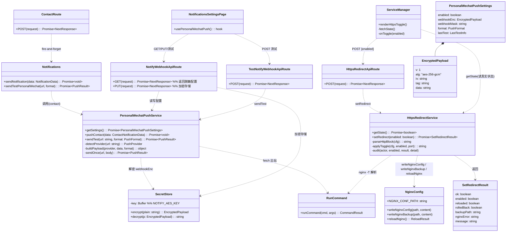
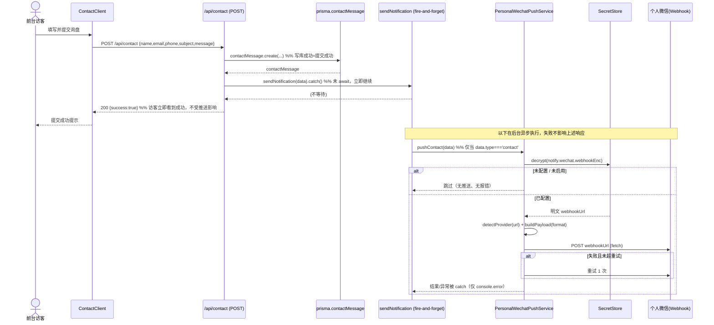
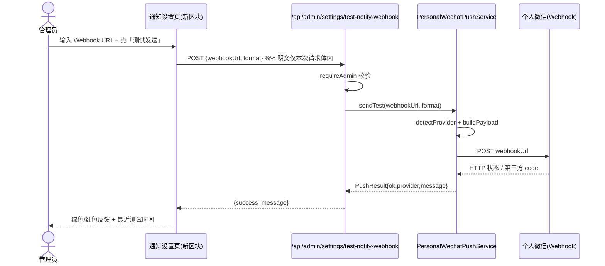
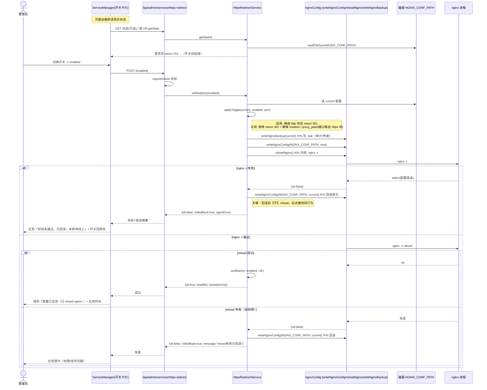
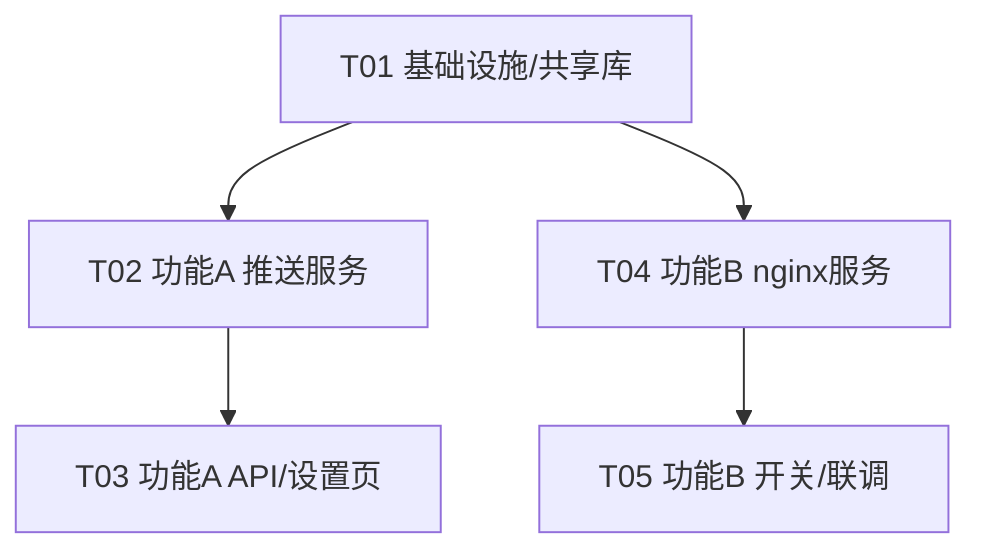

# 系统架构设计 + 任务分解：个人微信推送（功能 A）& 整站 HTTPS 强制跳转开关（功能 B）

> 文档类型：增量架构设计 + 任务分解
> 适用项目：`smart-cabinet`（已有 Next.js 14 + Prisma/PostgreSQL + TypeScript 项目）
> 架构师：高见远（software-architect）
> 日期：2026-07-12
> 配套 PRD：`deliverables/PRD_notify_https_2026-07-12.md`

---

## 0. 调研结论（基于实际读码，非假设）

| # | 调研点 | 实际代码事实 | 设计推论 |
|---|--------|--------------|----------|
| 1 | 站点配置表 | `prisma/schema.prisma` 已存在 KV 模型 `SiteSettings { key @unique; value Json; updatedAt }`（`site_settings` 表）。现有通知相关 key：`wechatWebhookUrl`/`wechatNotificationEnabled`/`wechatPersonalEnabled`/`wechatPersonalSendKey`/`wecomAppEnabled` 等 | **复用 SiteSettings KV 模型，不新建表**。功能 A 新增命名空间 key `notify.wechat.*` |
| 2 | 联系表单 API | `src/app/api/contact/route.ts`：`POST`，字段 `{name,email,phone,subject,message}`，校验后 `prisma.contactMessage.create(...)`；**成功写库后已调用 `sendNotification(notificationData).catch(...)` 且未 await（fire-and-forget）**。唯一前台调用方 `src/app/[locale]/contact/ContactClient.tsx` | 路径/字段/触发点**已全部确认**。功能 A 只需在 `sendNotification` 内接入"个人微信推送"渠道，**无需改 contact route**；访客 200 与推送解耦，天然满足"推送失败不影响提交" |
| 3 | 通知设置页现状 | `src/app/xiaozhouBackend/settings/notifications/page.tsx` 已用 `useSettings()` 渲染企业微信群机器人/Server酱/企业微信应用三类区块 + `handleTestWebhook`→`/api/admin/settings/test-wechat`。统一存储于 `/api/admin/settings`（GET 全量 / PUT 批量 upsert） | 功能 A 新增**独立区块**"个人微信推送（询盘提醒）"，走**专用加密端点**（不污染通用 settings 的明文存储） |
| 4 | 服务管理页与 nginx 能力 | `src/app/xiaozhouBackend/services/page.tsx` 复用 `src/components/admin/ServiceManager.tsx`（注意：弃用的是 `src/app/admin/**` *路由*，共享组件 `src/components/admin/**` 仍被活动后台使用，可改）。`src/lib/services/nginxConfig.ts` 提供 `writeNginxConfig`（仅白名单 `NGINX_CONF_PATH`）、`reloadNginx()`（`nginx -t`→`nginx -s reload`）、`generateNginxConfig`；`src/lib/services/certificates.ts`/`runCommand.ts` 提供 `nginx -T` 解析与 execFile 安全执行 | 功能 B **复用** `writeNginxConfig`+`reloadNginx`+`runCommand`，新增 `httpsRedirect.ts` 做"读→备份→改→校验→reload→回滚"。HTTPS 开关加在 `ServiceManager` |
| 5 | 进程可否执行 nginx 命令 | 现有 `reloadNginx`/`uploadCertificate` 已直接 `runCommand('nginx',['-t'/'reload'])` 且生产在用；团队已知 **pm2 以 root 运行**，故应用进程具备 nginx 信号权限 | 按 **root 具备权限** 设计；运行时若 `nginx -t` 失败给出明确报错。需用户/运维拍板确认生产 pm2 用户确为 root（见 U1） |
| 6 | xiaozhouBackend 鉴权 | `src/lib/auth.ts` 提供 `requireAdmin`（校验后台 JWT + role=admin）与 `verifyAuth`（仅校验 JWT）。现有 `/api/admin/services` 与 `/api/admin/settings/test-wechat` 均用 `requireAdmin`；`/api/admin/settings` GET/PUT 用 `verifyAuth` | 两个新功能 API **统一用 `requireAdmin`**（仅 admin 可配），与现有 services/test-wechat 一致 |

**关键代码事实补充：**
- nginx 站点模板 `nginx-conf.d-smart-cabinet.conf` 的 http(:80) server 块**已含** `return 301 https://$host$request_uri;`（默认即强制 https）；该块当前**无 `location /`**，故"关闭重定向后允许 http 直访"必须同时补一个 `proxy_pass` 的 `location /`。
- `src/lib/notifications.ts` 已有 `sendPersonalWeChatNotification`（Server酱 `wechatPersonalSendKey`）与 `sendWeComAppNotification`（企业微信应用），并在 `sendNotification` 内一并调用。功能 A 将用新的统一"Webhook URL"渠道**取代/去重**旧的 Server酱 SendKey 路径（避免双发）。
- 加密：当前 settings 端点**明文**存储 value（无加密）。PRD A-P0-4 要求 webhook URL 加密/脱敏，故功能 A 必须走专用端点 + 应用层 AES 加密。

---

## 1. 实现方案 + 框架选型

**严格沿用现有栈**（不引入新框架）：Next.js 14.2 App Router + React 18 + Prisma/PostgreSQL + TypeScript + Tailwind（后台组件用 `admin-*` 类）。

| 难点 | 选型 / 方案 |
|------|-------------|
| 个人微信推送（PushPlus/Server酱） | 不锁定单一服务商：按 Webhook URL 的 host **自动识别 provider**，构造对应请求体。复用既有 `fetch` 出站，无第三方 SDK 依赖 |
| Webhook URL 加密存储 | Node 内置 `crypto`：AES-256-GCM，密钥取自环境变量 `NOTIFY_AES_KEY`（32 字节）。密文以 JSON `{v,alg,iv,tag,data}`（base64）存入 `siteSettings`；前端只拿掩码 `webhookMask`，绝不明文返回 |
| 异步非阻塞推送 | 直接复用 contact route 已有的 `sendNotification().catch()` fire-and-forget 模式，**不引入消息队列**；失败 1 次短时重试（A-P1-2）+ 控制台日志（不落库、不阻塞访客） |
| HTTPS 开关（nginx 层） | 复用 `nginxConfig.writeNginxConfig`（白名单写）+ `reloadNginx`（`nginx -t` 校验→`nginx -s reload`）。新增 `HttpsRedirectService`：读活动配置→备份→切换 `return 301` 行（关闭时补 `proxy_pass` location）→校验→reload→失败回滚原文件且不 reload |
| 状态真实可读（B-P1-1） | 开关初始值**直接解析 nginx 活动配置**的 http server 块是否含 `return 301 ...`，而非前端记忆/DB 期望态 |
| 权限 | 新 API 全部 `requireAdmin`，与现有 services/test-wechat 一致 |

**架构模式**：后台 CRUD/配置类沿用现有"统一 settings KV + 专用端点"模式；nginx 运维类沿用"白名单命令 + execFile（无 shell）"安全模式（见 `ARCHITECTURE-V8 §7.7`）。

---

## 2. 文件列表（相对路径）

```
# ── 功能 A：个人微信推送 ──
src/lib/services/secretStore.ts                              # 【新增】AES-256-GCM 加解密（NOTIFY_AES_KEY）
src/lib/notify-types.ts                                      # 【新增】共享类型（ContactPushConfig / EncryptedPayload / PushResult / PushProvider 等）
src/lib/services/personalWechatPush.ts                       # 【新增】PersonalWechatPushService：读配置/识别 provider/构造 payload/发送/重试/测试
src/lib/notifications.ts                                     # 【改】sendNotification 内接入 personalWechatPush（仅 contact 类型）；新增 sendTestPersonalWechat()
src/app/api/admin/settings/notify-webhook/route.ts           # 【新增】GET(返回脱敏配置) / PUT(加密存储)
src/app/api/admin/settings/test-notify-webhook/route.ts      # 【新增】POST 测试发送（requireAdmin）
src/lib/usePersonalWechatPush.ts                             # 【新增】后台页专用 hook（替代 useSettings 子集）
src/app/xiaozhouBackend/settings/notifications/page.tsx      # 【改】新增"个人微信推送（询盘提醒）"区块（输入/格式下拉/保存/测试/掩码/状态）

# ── 功能 B：HTTPS 强制跳转开关 ──
src/lib/services/httpsRedirect.ts                            # 【新增】HttpsRedirectService：getState / setRedirect（备份-改-校验-reload-回滚）+ 审计日志
src/lib/services/nginxConfig.ts                             # 【改】扩展白名单：导出 writeNginxBackup(path)；允许 ${NGINX_CONF_PATH}.bak[.timestamp]
src/app/api/admin/services/https-redirect/route.ts           # 【新增】POST {enabled}（requireAdmin）→ HttpsRedirectService.setRedirect
src/components/admin/ServiceManager.tsx                      # 【改】新增"强制 HTTPS 跳转"开关卡片（读真实状态/二次确认/反馈/回滚提示）
src/messages/admin.zh.json (+ en.json/ar.json)              # 【改】新增开关相关中文标签（后台已固定中文，可内联，但建议走字典）

# ── 基础设施 / 共享（T01）──
.env / .env.example                                          # 【改】新增 NOTIFY_AES_KEY
nginx-conf.d-smart-cabinet.conf                              # 【改】http server 块增加 location / proxy_pass（保留 return 301 作为可切换标记）
prisma/schema.prisma                                         # 【不改】复用 SiteSettings，无需 migration（运行时 upsert 新增 key 即可）
src/app/api/contact/route.ts                                 # 【不改】已 fire-and-forget，推送接入点在 sendNotification
```

> 说明：`prisma/schema.prisma` 与 `src/app/api/contact/route.ts` 均**无需改动**（重要结论，已验证）。

---

## 3. 数据结构和接口（类图）



**核心类型（JSON Schema 风格，仅定义，不实现）**

```ts
// src/lib/notify-types.ts
type PushFormat = 'markdown' | 'text';
type PushProvider = 'serverchan' | 'pushplus' | 'generic';

interface EncryptedPayload {        // 存入 siteSettings.value
  v: 1; alg: 'aes-256-gcm';
  iv: string; tag: string; data: string;   // 均为 base64
}
interface PersonalWechatPushSettings {
  enabled: boolean;
  webhookEnc: EncryptedPayload;     // 密文，绝不返回明文给前端
  webhookMask: string;              // 如 "https://sctapi.ftqq.com/abc****.send"
  format: PushFormat;
  lastTest: { status: 'success'|'fail'|null; at: string; message?: string } | null;
}
interface PushResult { ok: boolean; provider: PushProvider; httpStatus?: number; message?: string; }

// SiteSettings 新增 key（命名空间 notify.wechat.*）
//  notify.wechat.enabled      : boolean
//  notify.wechat.webhookEnc   : EncryptedPayload(JSON)
//  notify.wechat.webhookMask  : string
//  notify.wechat.format       : 'markdown'|'text'
//  notify.wechat.lastTest     : JSON

// src/lib/services/httpsRedirect.ts
interface SetRedirectResult {
  ok: boolean; enabled: boolean; reloaded: boolean; rolledBack: boolean;
  backupPath?: string; nginxError?: string; message: string;
}
// SiteSettings 审计 key: audit.httpsRedirect = HttpsRedirectAuditEntry[]
//  nginx.httpsRedirect.state 不存（状态以 nginx 真实配置为准）
```

---

## 4. 程序调用流程（时序图）

### 4.1 功能 A — 联系表单提交异步推送（访客零阻塞）



### 4.2 功能 A — 后台「测试发送」



### 4.3 功能 B — HTTPS 开关：备份→改→校验→reload→回滚



---

## 5. 任务列表（有序、含依赖、P0/P1）

> 规则遵循：≤5 个任务；每任务 ≥3 文件；T01 为基础设施（env + 加密/类型 + nginx 模板）。依赖尽量只指向 T01，避免长链。

| Task | 名称 | 源文件 | 依赖 | 优先级 |
|------|------|--------|------|--------|
| **T01** | 基础设施与共享库 | `.env(.example)`(+NOTIFY_AES_KEY)、`nginx-conf.d-smart-cabinet.conf`(http 块加 proxy location)、`src/lib/services/secretStore.ts`、`src/lib/notify-types.ts` | — | **P0** |
| **T02** | 功能A：推送服务与通知集成 | `src/lib/services/personalWechatPush.ts`、`src/lib/notifications.ts`(接入)、`src/lib/notify-types.ts`(T01 已建，此处补全契约) | T01 | **P0** |
| **T03** | 功能A：后台 API 与设置页 | `src/app/api/admin/settings/notify-webhook/route.ts`、`src/app/api/admin/settings/test-notify-webhook/route.ts`、`src/app/xiaozhouBackend/settings/notifications/page.tsx`、`src/lib/usePersonalWechatPush.ts` | T02 | **P0** |
| **T04** | 功能B：nginx 重定向服务与 API | `src/lib/services/httpsRedirect.ts`、`src/lib/services/nginxConfig.ts`(扩展 backup 白名单)、`src/app/api/admin/services/https-redirect/route.ts` | T01 | **P0** |
| **T05** | 功能B：服务管理页开关 + 联调 | `src/components/admin/ServiceManager.tsx`、`src/messages/admin.zh.json`(+en/ar)、联调/构建验证 | T04 | **P0/P1** |

**依赖图**



**任务要点（实现顺序）**
- **T01**：加 `NOTIFY_AES_KEY` 到 `.env(.example)`；`secretStore.ts` 实现 AES-256-GCM（iv 随机、tag 校验、失败抛错）；`notify-types.ts` 定义全部类型；改造 nginx 模板——http server 块在 `return 301` 之后追加 `location / { proxy_pass http://localhost:__PORT__; 同 https 块的 proxy 头 }`，使"关闭重定向"时 http 仍可直访（端口占位 `__PORT__` 由运行时填充；生产活动配置已是真实端口）。
- **T02**：`personalWechatPush.ts` 实现 provider 识别（serverchan/pushplus/generic）、payload 构造（markdown 默认，Server酱 `{title,desp}`、PushPlus `{token,title,content}`、token 从 URL `?token=` 提取）、`fetch` 发送、失败 1 次重试；`notifications.ts` 在 `sendNotification` 内对 `type==='contact'` 调用该服务（读 `notify.wechat.*`、解密、发送；未配置则静默跳过），并新增 `sendTestPersonalWechat(url,format)`。
- **T03**：`notify-webhook` 路由 GET 返回脱敏配置（`enabled/format/webhookMask/lastTest`，**绝不返回 webhookEnc 明文**），PUT 接收 `{enabled,webhookUrl,format}` → 加密存 `notify.wechat.webhookEnc`、算 `webhookMask` 存 `webhookMask`、更新 `lastTest`；`test-notify-webhook` 路由 POST 调 `sendTestPersonalWechat`；设置页新增区块（输入/格式下拉/保存/测试/掩码展示/未配置提示）；`usePersonalWechatPush.ts` 提供独立 hook。
- **T04**：`nginxConfig.ts` 扩展 `ALLOWED_WRITE_PATHS` 允许 `${NGINX_CONF_PATH}.bak` 与 `${NGINX_CONF_PATH}.bak.<timestamp>`，导出 `writeNginxBackup`；`httpsRedirect.ts` 实现 `getState()`（解析 http 块是否含 `return 301 https://$host$request_uri;`）、`setRedirect(enabled)`（读→备份→`applyToggle`→写→`reloadNginx`→失败回滚原文件且不 reload→审计日志写 `audit.httpsRedirect`）；`https-redirect` 路由 POST `{enabled}` 经 `requireAdmin` 后调用。
- **T05**：`ServiceManager.tsx` 新增"强制 HTTPS 跳转"卡片——挂载时 `getState()` 读真实状态；Switch 切换 disabled+「正在应用配置…」；成功绿提示+生效时间；`nginx -t` 失败自动回滚红提示+开关回原态；关闭时二次确认「关闭后 http 可直访（明文）」；备份提示「已自动备份至 /etc/nginx/conf.d/...bak」；新增 i18n 标签。`npm run build` + tsc 验证。

---

## 6. 依赖包

无需新增第三方运行时依赖。复用：
- `next` / `react` / `react-dom`（现有）
- `@prisma/client` / `prisma`（现有）
- Node 内置 `crypto`、`child_process`（经既有 `runCommand` execFile）
- `lucide-react`（图标，已用于 ServiceManager）

> 不引入队列（BullMQ 等）、不引入第三方推送 SDK（PushPlus/Server酱 直接 `fetch`）。若后续要做 A-P2 多接收人/队列，再评估。

---

## 7. 共享知识（跨文件约定）

1. **Webhook 配置统一存 `SiteSettings` KV**，命名空间 `notify.wechat.*`：`enabled` / `webhookEnc`(密文) / `webhookMask`(掩码) / `format` / `lastTest`。无需新建 Prisma model，运行时 `upsert`。
2. **加密**：AES-256-GCM，密钥 `NOTIFY_AES_KEY`（32 字节，hex 或 base64，生产必填）。密文格式 `{v:1, alg:"aes-256-gcm", iv, tag, data}`（base64）。`SecretStore` 是唯一加解密入口。
3. **脱敏展示**：前端只拿 `webhookMask`；`notify-webhook` GET **绝不返回 `webhookEnc` 明文**；保存时明文仅在 PUT 请求体内经 HTTPS 传输，服务端加密后落库。
4. **HTTPS 状态以 nginx 真实配置为准**：`getState()` 解析 `NGINX_CONF_PATH` 的 http server 块是否含 `return 301 https://$host$request_uri;`。**不**另存"期望状态"到 DB（避免漂移）。
5. **备份与回滚约定**：切换前写 `${NGINX_CONF_PATH}.bak`（最新一份，可加时间戳）。回滚 = 把原内容写回 `NGINX_CONF_PATH` 且**不 reload**。所有写仅限白名单 `NGINX_CONF_PATH`（及 `.bak` 兄弟路径）。
6. **nginx 操作安全契约**（沿用 ARCHITECTURE-V8 §7.7）：一律 `runCommand`(execFile，无 shell)；用户参数先白名单校验；`nginx -t` 校验通过才 `nginx -s reload`。
7. **权限**：所有新 API 用 `requireAdmin`（role=admin），与 `/api/admin/services`、`/api/admin/settings/test-wechat` 一致。
8. **provider 识别（按 URL host）**：
   - `sctapi.ftqq.com` / `sc.ftqq.com` → Server酱，body `{title, desp}`
   - `pushplus.plus` / `www.pushplus.plus` → PushPlus，body `{token, title, content}`，token 取自 URL `?token=`
   - 其他 → 通用 `{title, content}`（默认 markdown）
9. **内容长度/截断**：Server酱 `title≤30` 字、`desp` 长文本；PushPlus `content` 支持 markdown（免费版约 200 条/天、单条 ~8KB）。超长截断并标注「…(已截断)」。
10. **异步非阻塞**：推送在 contact route 内 fire-and-forget（沿用 `sendNotification().catch()`），失败仅 `console.error`，不影响访客 200 与写库。
11. **环境差异**：dev/staging 不配置 `notify.wechat.webhookEnc` 即不推送（零影响）；prod 配置后生效。测试发送在生产会**真实**推到个人微信。

---

## 8. 对 PRD 9 项待确认问题的技术结论

| # | PRD 待确认 | 技术结论 | 处置 |
|---|-----------|----------|------|
| 1 | Webhook 存储方案 | **复用 `SiteSettings` KV（已存在 model），不新建表**；webhook URL 走 `notify.wechat.webhookEnc`（AES-256-GCM 加密） | 已定 |
| 2 | 联系表单 API 路径/字段/成功时机 | 已确认：`src/app/api/contact/route.ts`，字段 `name/email/phone/subject/message`；**写库成功即触发**（已 fire-and-forget）；**无需改路由**，推送接入点在 `sendNotification` | 已定 |
| 3 | nginx 现状/默认状态 | 模板 http 块**已含** `return 301`（默认即强制 https）。开关**初始值从 nginx 真实状态读取**，不硬编码默认；建议默认"开"（与现状一致） | 已定（默认读真实态）；**U2 需用户确认**"接受开关只是显式管理既有的强制 https" |
| 4 | nginx 写入细节/权限 | 写 `NGINX_CONF_PATH`(`/etc/nginx/conf.d/smart-cabinet.conf`)，server 块在 conf.d；reload 走 `nginx -t`+`nginx -s reload`(execFile)。按 **pm2 root** 设计 | 已定；**U1 需运维确认** pm2 运行用户具备 nginx 信号权限 |
| 5 | 权限模型 | **仅 admin**，复用 `requireAdmin` + 现有后台 JWT，与 services/test-wechat 一致 | 已定 |
| 6 | 推送格式与字段 | 默认 **markdown**；字段=姓名/联系方式/留言/来源页/提交时间；按第三方限制截断 | 已定 |
| 7 | 第三方选型与配额 | **PushPlus 与 Server酱 双兼容**（URL 自动识别），用户自管 token/key；失败返回具体 HTTP 状态/第三方 code（401/额度耗尽等） | 已定（不锁定单一） |
| 8 | 异步实现位置 | **API route 内 fire-and-forget**（沿用现有模式），**不引队列**；失败 1 次重试 + 控制台日志（不落库、不阻塞） | 已定 |
| 9 | 多环境/生产安全 | dev/staging 不配则不推；prod 配置后生效。测试发送在生产会真推 | 已定；**U3 需用户确认**"是否允许在生产后台点测试发送真推"（建议允许，附二次确认） |

### 仍需用户/运维拍板（U 系列）
- **U1（运维）**：确认生产 pm2 运行用户为 root（或具备 `nginx -t` / `nginx -s reload` 权限）。若非 root，需配置 sudoers 或改用 systemd，将影响 T04 的 reload 实现细节。
- **U2（产品/运维）**：是否接受"当前站点默认已是强制 https，HTTPS 开关仅作为显式管理入口"（我建议是，开关初始态读真实配置）。
- **U3（产品）**：是否允许在生产后台点击"测试发送"真实推送到个人微信（我建议允许，附二次确认文案）。
- **U4（产品，低优先级）**：旧 Server酱 `wechatPersonalSendKey` 配置是否迁移到新 `notify.wechat.webhookEnc`？（我建议**不做迁移**，新旧字段独立；旧路径从 `sendNotification` 移除调用以避免双发，旧 key 残留 DB 无害。）
- **U5（范围）**：B-P2-2 证书过期检测本次是否做？（我建议 P2 暂不做，仅保留关闭 https 时的风险提示文案。）

---

## 9. 范围边界（明确不做，与 PRD 一致）
- 不做企业微信群机器人推送（已有，不在本次范围）。
- 不改动 `src/app/admin/**`（已弃用 404）；但**可改**共享组件 `src/components/admin/**`（活动后台在用）。
- 不做应用层中间件跳转（功能 B 必须在 nginx 层实现）。
- 不引入 certbot 或自动证书管理（保持手工证书现状）。
- 不新建 Prisma model / migration（复用 `SiteSettings`）。
- 不引入消息队列。
