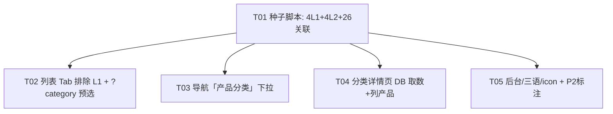

# 系统架构设计 + 任务分解：Smart Cabinet 产品两级分类体系重构

> 文档 owner：架构师（高见远 / Bob）
> 日期：2026-07-04
> 范围：为 v265 导入的 26 个真实产品补齐「一级分类(L1) + 子分类(L2)」两级体系，并让前端列表 / 导航 / 筛选正确反映层级。
> 上级输入：`docs/category-restructure-prd.md`（产品经理 Alice）
> 配套图：`docs/class-diagram.mermaid`、`docs/sequence-diagram.mermaid`

---

## 0. 代码核实结论（基于实际读码，非 PRD 转述）

| 核实项 | PRD 说法 | 实际代码（已读） | 设计影响 |
|---|---|---|---|
| Category 模型两级能力 | 已具备，无需迁移 | `prisma/schema.prisma` L49-71：`parentId / children / parent` + `type` 默认 `'product'` ✓ | 不跑 migrate，只填数据 |
| 列表页维度 Tab | 由 `category.type` 推导 | `products/page.tsx` L244-245：`categoryTypes = [...new Set(categories.map(c=>c.type).filter(Boolean))]`，**未排除 L1 的 `type='product'`** → 若不处理会出现多余「product」Tab | **必须**在 L245 加 `.filter(t => t !== 'product')` |
| 列表页是否读 `?category=` | （隐含可按分类过滤） | `products/page.tsx` 用内部 state `activeCategories`(ID)，**全文未读 URL query**，导航点 L2 跳转 `/products?category=<slug>` 不会预选 | 需加 ~15 行读取 `?category=slug` 预选逻辑 |
| `/api/categories` | 返回 children/parent | `src/app/api/categories/route.ts` L32-46：`include children + parent` ✓ | 导航下拉直接复用 |
| `/api/products` 分类过滤 | （未明说） | `src/app/api/products/route.ts` L22/44-50：`?category=<ID>` 支持 **按 ID** 过滤（非 slug） | 分类详情页先用 slug→id 解析再传 ID |
| 分类详情页数据源 | 读静态 `fetchUnifiedCategories()`，非 DB | `category/[slug]/page.tsx` L5 + `unified-data.ts` L293-335：`fetchUnifiedCategories()` **内部调 `GET /api/categories`（即 DB）** | PRD 已过时——**详情页早已 DB 驱动**；P1-2 实质是「列出该分类产品」，而非换数据源 |
| 后台分类 CRUD | POST/PUT 支持 parentId/type/name/slug/order/status/icon | `src/app/api/admin/categories/route.ts` L91-226 完整支持 ✓ | 无需改 API |
| 产品编辑多选分类 | 按 type 分组 | `admin/products/edit/[id]/page.tsx` L490-548：按 `cat.type` 分组渲染多选；**会把 L1(type='product')也列进「product」组** | P2 微调：过滤 `parentId != null` |
| seed 脚本位置/留空 | `seed-products.ts:17` 有意跳过 categories | 已读：`scripts/import/seed-products.ts` 注释 L17 + 仅 upsert 产品+FAQ ✓ | 新增独立 `seed-categories.ts`，不动原脚本 |
| 翻译源文件 | `_input_sheet0~3.json` | 实际位于 `scripts/import/translations/_input_sheet0~3.json`（PRD 路径少一层 `translations/`）✓；结构 `{sheet, dimension, products:[{slug, sku, name_en, ...}]}` | 种子脚本读此路径 |

**关键决策已采纳（来自主理人拍板）**：L1 用 `type='product'`（不进 Tab）；产品仅关联 L2；slug 语义化；导航 L1 仅作展开容器、行为落 L2 链接；分类详情页 DB 驱动。

---

## 1. 实现方案

### 1.1 框架选型
- **沿用现有栈，不新增任何框架**：Next.js 14 App Router（TypeScript）+ Prisma + PostgreSQL + Tailwind CSS + lucide-react / @heroicons/react。
- 种子脚本沿用 `scripts/import/seed-products.ts` 同款方式：`ts-node --compiler-options {"module":"CommonJS"}`，`PrismaClient` 直连。
- **依赖包列表为空**——无需安装任何新库（详见 §7）。

### 1.2 架构模式
- 数据层：Prisma `Category`（自引用）+ `ProductCategory` 隐式多对多关联表（已在 schema 中通过 `@relation(map:"ProductCategory")` 定义）。
- 取数层：公开 `GET /api/categories`（含 children/parent）、`GET /api/products?category=<id>`；前端 `fetchUnifiedCategories()` 归一化为 `LocalCategory[]`。
- UI 层：在 `products/page.tsx` 复用现有「维度 Tab + 子分类 Pill」；新增 `CategoryNavMenu.tsx` 作为 Navbar 的下拉子组件；`category/[slug]/page.tsx` 增强为「标题 + 产品网格」。

### 1.3 两级体系映射（design source of truth）

| Sheet 文件 | L1 name(zh) | L1 slug | L2 type | L2 dimension(en) | L2 slug | 产品数 | SKU 范围 |
|---|---|---|---|---|---|---|---|
| `_input_sheet0.json` | 按照柜体分类 | `cat-cabinet` | `cabinet-type` | By cabinets types | `sub-cabinet-types` | 8 | CAB-001~008 |
| `_input_sheet1.json` | 按照物料管理分类 | `cat-managed-items` | `managed-items` | By Managed items | `sub-managed-items` | 9 | MAT-001~009 |
| `_input_sheet2.json` | 按照行业分类 | `cat-industry` | `industry` | By industries | `sub-industries` | 8 | IND-001~008 |
| `_input_sheet3.json` | 其他 | `cat-others` | `custom-solution` | Others | `sub-others` | 1 | OTH-001 |

- **L1 仅 1 个**：`type='product'`，`parentId=null`，`order=1..4`。
- **L2 仅 1 个**：`parentId` 指向对应 L1，`type` 取上表维度值，`order=1..4`（建议与 L1 同序，便于稳定排序）。
- **产品只连 L2**（通过 `ProductCategory`），L1 经 `parent` 间接归属，查询不冗余。

---

## 2. 文件列表（新建 / 修改 标注）

| 路径 | 动作 | 说明 |
|---|---|---|
| `scripts/import/seed-categories.ts` | **新建** | 读 `translations/_input_sheet0~3.json`，upsert 4 L1 + 4 L2，按 slug 关联 26 产品（幂等） |
| `src/app/[locale]/products/page.tsx` | **修改** | L245 维度 Tab 排除 `type='product'`；新增读取 `?category=<slug>` 预选 activeDimension+activeCategories（约 +15 行，置于 loadData effect 内） |
| `src/components/layout/CategoryNavMenu.tsx` | **新建** | 「产品分类」两级下拉组件（客户端，挂载时 `GET /api/categories`，渲染 L1→L2；L2 链接 `/{locale}/products?category=<slug>`；桌面 hover/click 展开、移动端抽屉） |
| `src/components/layout/Navbar.tsx` | **修改** | 在桌面 nav-links 区与移动端抽屉 nav 区各引入 `CategoryNavMenu`，替换单一「products」硬链接为「产品 ▾」菜单（L52-60 `navLinks` 不改，新增独立菜单项） |
| `src/app/[locale]/category/[slug]/page.tsx` | **修改** | 在已有 `fetchUnifiedCategories()` 基础上，追加 `GET /api/products?category=<L2.id>&status=all` 取该分类产品并渲染网格（保留标题/面包屑） |
| `src/app/api/products/route.ts` | **可选微调** | 若希望导航直接传 slug，可加 `?category=<slug>` 支持（解析 slug→id）；**本次默认不改**，详情页用 slug→id 两步取数 |
| `src/app/admin/products/edit/[id]/page.tsx` | **P2 微调** | L490 分组时过滤 `parentId != null`，避免 L1 出现在产品多选列表的「product」组 |
| `scripts/import/translations/_input_sheet0~3.json` | 只读 | 种子脚本输入源（已存在） |

> 说明：`category/[slug]/page.tsx` 已 `import { fetchUnifiedCategories } from '@/data/unified-data'`（即 DB 驱动），无需改 `unified-data.ts`。

---

## 3. 数据结构与接口

详见 `docs/class-diagram.mermaid`（Mermaid classDiagram）。要点：

- **Category（Prisma）**：`id / slug(unique) / name(Json{zh,en,ar}) / icon / description / parentId / order / status / type`，自引用 `children[]` / `parent`。
- **Product（Prisma）**：`categories: Category[]`（隐式 `ProductCategory` 关联）。
- **LocalCategory（前端归一化）**：`fetchUnifiedCategories()` 把 DB `name` 拆成 `nameZh/nameEn/nameAr`，并带 `parentId/type/slug/order/status`。
- **接口契约**：
  - `GET /api/categories` → `Category[]`（含 `children`/`parent`），公开、按 `order` 升序。
  - `GET /api/products?category=<id>&status=all` → `{ data: Product[], total, page, pageSize }`，`data` 含 `categories:[{id,name,slug,type}]`。
  - 种子脚本直接 `prisma.category.upsert` + `prisma.product.update({data:{categories:{connect:{slug}}}})`。

---

## 4. 程序调用流程

详见 `docs/sequence-diagram.mermaid`（Mermaid sequenceDiagram），覆盖 4 个关键流程：
1. **种子脚本运行**（一次性、幂等）：upsert L1 → upsert L2（挂 parentId）→ 按 slug connect 26 产品。
2. **导航下拉渲染**：`CategoryNavMenu` 挂载拉 `/api/categories`，过滤 `parentId==null` 得 L1，渲染其 `children` 为 L2，点击 L2 → `/{locale}/products?category=<slug>`。
3. **列表筛选渲染**：`products/page.tsx` 拉 products+categories，`categoryTypes` 排除 `type='product'`，读 `?category=slug` 预选维度与子分类，渲染过滤后网格。
4. **分类详情页 DB 取数**：`category/[slug]/page.tsx` 用 `fetchUnifiedCategories()` 按 slug 定位 L2 → 取其 `id` → `GET /api/products?category=<id>` 列产品。

---

## 5. 任务列表（有序 · 含依赖 · 验收点）

> 依赖关系：T01（数据）是所有 UI 任务的前置；T02/T03/T04/T05 在 T01 完成后可并行。P2 项单独标注延后。

### T01 · 种子脚本：建 4 L1 + 4 L2 + 关联 26 产品
- **依赖**：无（前置条件：v265 产品已 seed 入库）
- **文件**：`scripts/import/seed-categories.ts`（新建）
- **动作**：
  1. 内置 `MAPPING`（4 项，对应 §1.3 表：sheet 文件 → L1{slug,name{zh},type:'product',order} / L2{slug,type,dimension,name{en,zh,ar},order}）。
  2. 逐 sheet `prisma.category.upsert`（按 slug 唯一），先建 L1 取其 id，再建 L2 设 `parent:{connect:{id:L1id}}`。
  3. 对每个 `products[].slug`，`prisma.category.update({where:{id:L2id}, data:{products:{connect:{slug: p.slug}}}})`。
  4. `--dry-run` 支持；缺失产品 slug 时 `console.warn` 不中断；最终打印 `4 L1 / 4 L2 / 26 关联`。
- **验收点**：
  - `npx ts-node .../seed-categories.ts --dry-run` 解析出 26 产品、4 L1、4 L2；
  - 真实运行后 DB 中 8 个 Category，`slug` 恰为 §1.3 表所列，`parentId` 正确；
  - 每产品 `categories` 含且仅含 1 个 L2；重复运行幂等（无重复关联/分类）。

### T02 · 产品列表页：维度 Tab 排除 L1 + 支持 `?category=` 预选
- **依赖**：T01
- **文件**：`src/app/[locale]/products/page.tsx`（修改 L245、loadData effect）
- **动作**：
  1. L245：`categoryTypes` 过滤掉 `'product'`（及 `'blog'/'faq'` 防御），即 `.filter(t => t && t !== 'product')`。
  2. 在 `loadData` 的 `useEffect` 内（或独立 effect），读取 `window.location.search` 的 `category` 参数（**用 `window.location` 而非 `useSearchParams`，避免 Suspense 边界要求**）；当 categories 加载完成后，按 slug 找到对应 L2，设 `activeDimension = l2.type`、`activeCategories = [l2.id]`。
- **验收点**：
  - 列表维度 Tab 仅出现 4 个维度（柜型/管理物料/行业/定制方案），**不出现**「product」Tab；
  - 直接访问 `/en/products?category=sub-cabinet-types` 自动选中「柜型分类」维度并预选该子分类 Pill，结果 = CAB-001~008（8 个）；
  - `/zh/products` 维度 Tab 计数合计 = 26。

### T03 · 顶部导航：新增「产品分类」两级下拉
- **依赖**：T01
- **文件**：`src/components/layout/CategoryNavMenu.tsx`（新建）、`src/components/layout/Navbar.tsx`（修改）
- **动作**：
  1. 新建 `CategoryNavMenu`（客户端组件）：挂载 `fetch` `/api/categories`，本地计算 `L1 = cats.filter(c=>!c.parentId)`，`L2 = c.children`（或 `cats.filter(x=>x.parentId===L1.id)`）；渲染 L1 表头 + L2 链接 `Link href=/{locale}/products?category={L2.slug}`。
  2. 桌面：hover/click 展开浮层（参考现有语言切换浮层实现）；移动端：嵌入现有抽屉 `nav` 区，点击 L1 展开 L2。
  3. `Navbar.tsx`：在桌面 `navLinks` 区「products」项位置改为渲染 `<CategoryNavMenu/>`（保留「首页」等其他链接）；移动端抽屉 `nav` 区同样引入。
- **验收点**：
  - 桌面 hover「产品 ▾」出现 4 个 L1，每项右侧/下方列出其 L2，点击 L2 跳转到 `/{locale}/products?category=<slug>` 且列表已按该分类过滤（结合 T02）；
  - 移动端抽屉内能逐级展开 L1→L2；
  - L1 本身不可点（仅容器），符合 P0 决策。

### T04 · 分类详情页：DB 驱动 + 列出该分类产品（P1-2 实质内容）
- **依赖**：T01
- **文件**：`src/app/[locale]/category/[slug]/page.tsx`（修改）
- **动作**：
  1. 保留现有 `fetchUnifiedCategories()` 按 slug 定位分类（已是 DB 驱动）；取该分类 `id`。
  2. 新增 `fetch('/api/products?category='+cat.id+'&status=all')` 取产品列表，渲染产品网格（复用 `getProductHref`、卡片样式可从 `products/page.tsx` 借鉴，但保持精简）。
  3. 标题/面包屑沿用现有 `displayName` 逻辑；面包屑 `首页 › 产品 › <L2名>`。
- **验收点**：
  - 访问 `/en/category/sub-cabinet-types` 显示标题「By cabinets types」+ 8 个 CAB 产品；
  - 访问 `/zh/category/sub-managed-items` 显示「按管理物料」+ 9 个 MAT 产品；
  - `generateMetadata` 标题含正确分类名（SEO 友好，P2-1 增强可后续接 sitemap）。

### T05 · 后台与翻译补全（P1-3/P1-4 + P2 标注）
- **依赖**：T01
- **文件**：`src/app/admin/products/edit/[id]/page.tsx`（P2 微调）、`scripts/import/seed-categories.ts`（L1/L2 三语 name 在本任务补译）
- **动作**：
  1. **P1-3 三语 name**：在 T01 的 `MAPPING` 中补齐 L1/L2 的 `zh`（L2 用「按柜体类型/按管理物料/按行业/其他」）/ `ar`（占位如 "حسب نوع الخزانة" 等，由翻译后续补）；L1.en 用 "By Cabinet Type"/"By Managed Items"/"By Industry"/"Others"。
  2. **P1-4 icon/order**：L2 `icon` 对齐现有 `dimensionDefaultIcons`（Archive/Package/Building2/Settings），`order` 1..4；L1 `icon` 可空或统一。
  3. **P2 微调**：产品编辑页 L490 分组时 `if (cat.parentId) ...` 仅显示 L2，避免 L1 出现在多选列表。
  4. **P2 延后项（仅标注，本次不做）**：P2-1 sitemap/规范 canonical；P2-2 全局面包屑组件；P2-3 L1 聚合页（`/category/<L1.slug>` 列出其下所有 L2 产品）；P2-4 子分类语义化 URL 规范化。
- **验收点**：
  - 后台「分类管理」页可见 4 L1 + 4 L2 且父子正确；
  - 产品编辑页分类多选**仅出现 L2**（4 个维度组），不出现 L1；
  - 中/英/阿三语站导航与列表均显示正确分类名（RTL 阿语正常）。

---

## 6. 任务依赖图

---

## 7. 依赖包列表

**无需新增任何第三方依赖。** 全部复用现有栈：
- 运行时：`next@14`、`react`、`@prisma/client`、`lucide-react`、`@heroicons/react`、`tailwindcss`。
- 脚本：`typescript`、`ts-node`、`prisma`（均已在 `devDependencies`）。
- 若后续要做 P2-3 L1 聚合页，也无需新包。

---

## 8. 共享知识（跨文件约定）

- **slug 规则**：语义化英文小写连字符，stable 且 URL 友好。
  - L1：`cat-cabinet` / `cat-managed-items` / `cat-industry` / `cat-others`
  - L2：`sub-cabinet-types` / `sub-managed-items` / `sub-industries` / `sub-others`
  - ⚠️ 导航/列表所用 L2 slug 必须与种子脚本写入的 slug **完全一致**（消费侧按 slug 匹配）。
- **type 取值**：L1 统一 `product`；L2 取 `cabinet-type` / `managed-items` / `industry` / `custom-solution`（与 `products/page.tsx` 的 `builtInTypeOrder` 及 `labelMap*` 对齐）。
- **name Json 结构**：统一 `{ zh: string, en: string, ar: string }`。L2.en 取 Excel `dimension`；L1.en 用 "By Cabinet Type" 等；缺失 `zh/ar` 由 T05 补译。
- **L1/L2 约定**：L1 `parentId=null`；产品**仅关联 L2**（`ProductCategory`），L1 经 `parent` 间接归属。
- **排序约定**：L1/L2 `order` 均用 1..4（同序），保证展示稳定。
- **数据消费方向**：所有前端分类均来自 `GET /api/categories`（经 `fetchUnifiedCategories()` 归一化），不写死分类名；维度 Tab 必须排除 `type='product'`。
- **幂等约定**：种子脚本按 `slug` upsert；产品关联用 `connect`（已关联则跳过，不重复）。

---

## 9. 待明确事项（仅列真正的技术风险）

1. **阿语(ar) 翻译**：L1/L2 的 `ar` 名需专业翻译（设计给占位串，如 "حسب نوع الخزانة" 等）。属内容风险，非技术阻塞——已按主理人授权用占位继续，T05 补译。
2. **L1 slug 是否被访问**：当前分类详情页按 slug 查找，若用户直接访问 `/category/cat-cabinet`（L1）会渲染一个只有标题的页（无产品列表，因为产品只连 L2）。**建议**：详情页对 `parentId==null` 的 L1 改为重定向/聚合其 children 产品，或返回 404。本设计 P0 不阻挡（L1 不可点击），**列为 P2-3 处理**。
3. **种子脚本执行权限/时机**：需在 v265 产品已入库后运行；建议纳入部署手册或 `package.json` script。无 schema 变更，安全可重跑。

---

## 10. 一句话结论

数据闭环（T01 一次性脚本建 4L1+4L2 并连 26 产品）是 P0 最小闭环的基石；列表页只需在 `products/page.tsx:245` 排除 `type='product'` 并加 `?category=slug` 预选；导航新增 `CategoryNavMenu` 下拉复用 `/api/categories` 的 children 层级；分类详情页早已 DB 驱动，P1-2 实质是「按 L2.id 拉产品列表」。全程**零新依赖、零 schema 迁移**。
