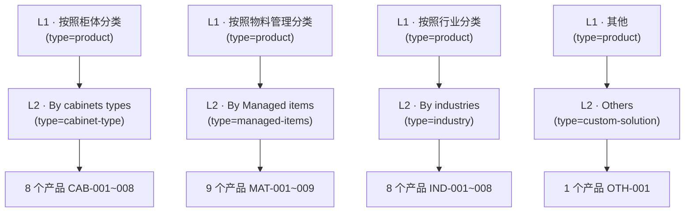

# 产品需求文档（PRD）：Smart Cabinet 产品两级分类体系重构

> 文档 owner：产品经理（Alice / 许清楚）
> 日期：2026-07-04
> 范围：为 v265 导入的 26 个真实产品补齐「一级分类 + 子分类」两级体系，并让前端列表 / 导航 / 筛选正确反映该层级。

---

## 1. 项目信息

- **Language（文档语言）**：中文（与需求方一致）
- **Programming Language**：Next.js 14 App Router + Prisma + PostgreSQL + Tailwind CSS（与现有栈一致，不新增框架）
- **Project Name**：`category_restructure`
- **原始需求复述**：
  v265 从 Excel 导入了 26 个真实产品，但 seed 时漏做了分类层级 —— `Product.categories` / `Product.tags` 被有意留空，导致产品无分类。
  正确的分类结构应来自 Excel 本身：**每个 sheet 名 = 一级分类（L1）**，**每个 sheet 第二行 = 子分类（sub-category）**，**第四行（产品名标题）= 产品英文名**。
  需求：按表格重建两级分类体系，把 26 个产品归到正确分类下，并更新前端列表 / 导航 / 筛选 UI 反映层级。

---

## 2. 产品定义

### Product Goals（3 个清晰、正交的目标）

1. **数据闭环**：在 `Category` 模型中落地「4 个一级分类 + 4 个子分类」两级结构，并把 26 个产品正确关联到对应子分类（P0 核心）。
2. **用户可发现**：在前端产品列表的「维度 Tab + 子分类筛选」与顶部导航下拉中，呈现并支持按两级层级浏览 / 筛选产品。
3. **可维护**：后台管理员可继续管理分类（增删改、设置父子关系、调整产品归属），无需改代码即可运营。

### User Stories

1. As a **访客**，I want 在产品列表按「柜体 / 物料 / 行业 / 其他」维度 + 对应子分类筛选产品，so that 我能快速定位需要的智能柜型号。
2. As a **访客**，I want 在顶部导航看到「产品」下的两级分类菜单（L1 → L2），so that 我无需进入列表页即可直达某一类目。
3. As a **访客**，I want 每个产品卡片显示其所属分类标签，so that 我能理解该产品的归类视角。
4. As an **运营/管理员**，I want 在后台查看并调整分类的父子关系与产品的分类归属，so that 后续新增产品/分类时不必改代码。
5. As a **SEO/内容**，I want 分类页有规范的标题、描述与面包屑，so that 分类可被搜索引擎收录、用户不迷路（P2）。

---

## 3. 技术规范

### 3.1 已验证事实（调研结论，供架构/开发参考）

- **4 个 sheet 的实际取值（与需求一致，已核对）**：

  | Sheet 文件 | L1 名（sheet） | 子分类（dimension） | 产品数 | SKU 前缀 | 建议 `type` |
  |---|---|---|---|---|---|
  | `_input_sheet0.json` | 按照柜体分类 | By cabinets types | 8 | CAB-001~008 | `cabinet-type` |
  | `_input_sheet1.json` | 按照物料管理分类 | By Managed items | 9 | MAT-001~009 | `managed-items` |
  | `_input_sheet2.json` | 按照行业分类 | By industries | 8 | IND-001~008 | `industry` |
  | `_input_sheet3.json` | 其他 | Others | 1 | OTH-001 | `custom-solution` |

  合计 **26 个产品**，每个 product 的 `slug` 已与数据库 `Product.slug` 对齐（注意部分 slug 带 `applications/`、`solutions/` 前缀及 `.html` 后缀，属正常）。

- **`Category` 模型已具备两级能力，无需新增字段**：
  `id / slug(unique) / name(Json{zh,en,ar}) / icon / description / parentId(可空) / order / status / type`，自引用关系 `children` / `parent`（`CategoryHierarchy`）已就绪。
  → **结论：建模层够用，只需填充数据 + 明确 `slug`/`order`/各语种 `name`**，不迁移 schema。

- **当前分类消费方式（关键）**：
  - 公开产品列表 `src/app/[locale]/products/page.tsx` **已具备两级筛选 UI**：
    - 第一行「维度 Tab」由 `category.type` 推导（`builtInTypeOrder = ['cabinet-type','managed-items','industry','custom-solution']`）；
    - 第二行「子分类 Pill」由 `categories.filter(c => c.type === activeDimension)` 渲染；
    - 产品通过 `product.categories[].id / .type` 过滤。
    - 维度图标/颜色 `dimensionColors`/`dimensionDefaultIcons` 已按上述 4 个 `type` 配置。
  - 公开 `GET /api/categories` 已返回 `children` 与 `parent`（层级数据现成）。
  - **顶部导航 `Navbar.tsx` 的链接是硬编码的**（`home/products/about/solutions/blog/faq/contact`），**目前完全不渲染分类菜单** → 需新增「产品分类」下拉组件（P0 新增 UI）。
  - 分类详情页 `src/app/[locale]/category/[slug]/page.tsx` **读取的是静态数据 `fetchUnifiedCategories()`（`src/data/unified-data.ts`），并非数据库** → 与新产品分类不一致，需 P1 改为 DB 驱动或同步静态数据（见 Open Questions / P1）。

- **seed 为何留空 / 如何补**：
  - `scripts/import/seed-products.ts` 第 17 行明确注释「categories / tags 不导入（保持为空）」，脚本只 upsert 产品 + FAQ。
  - 可用两种补数方式（二选一，建议方案 A）：
    - **A. 新增一次性脚本 `scripts/import/seed-categories.ts`**：读取 `scripts/import/translations/_input_sheet0~3.json`（或 `source/products_data.json` 的 `sheets[]`），按映射创建 4 L1 + 4 L2，并按产品 `slug` 关联 `ProductCategory`。
    - **B. 复用后台 `POST /api/admin/categories` + 产品编辑页多选**：人工或脚本调用 API 批量建分类并关联产品（API 已支持 `parentId`）。

- **后台能力（P1 可行性）**：
  - `src/app/api/admin/categories/route.ts` 已支持完整 CRUD，且 `POST`/`PUT` 接受 `parentId`、`type`、`name`(Json)、`slug`、`order`、`status`、`icon` → 两级分类的「后台可管理」在 API 层已基本具备。
  - `src/app/admin/categories/page.tsx` 表单 state 含 `parentId: null`（第 320 行），但其 UI 是否存在「父分类选择器」下拉待确认（见 Open Questions）。
  - `src/app/admin/products/edit/[id]/page.tsx` 已支持产品多选分类（按 `type` 分组），即运营可手动调整产品归属。

### 3.2 Requirements Pool

#### P0（必须 — 能上线的最小闭环）
- **P0-1** 在 `Category` 表创建 **4 个一级分类（L1）**：`parentId=null`，`type` 使用非维度值（建议 `'product'`，避免泄漏进列表维度 Tab），`name` 至少含 `zh`（sheet 中文名），`slug` 唯一稳定。
- **P0-2** 在 `Category` 表创建 **4 个子分类（L2）**：`parentId` 指向对应 L1，`type` 取 `cabinet-type / managed-items / industry / custom-solution`，`name.en` 取 Excel `dimension`（如 "By cabinets types"），`slug` 唯一稳定。
- **P0-3** 将 **26 个产品** 通过 `ProductCategory` 关联到其所属 **L2 子分类**（按 sheet→dimension→slug 映射；OTH-001 归 `custom-solution` 下的 L2）。
- **P0-4** 产品列表页 `products/page.tsx` 两级筛选**正确呈现**：维度 Tab 由 L2 的 `type` 驱动、子分类 Pill 显示 L2；需小改以避免 L1（`type='product'`）作为多余维度 Tab 出现（建议：维度 Tab 仅取 `parentId != null` 的分类，或排除 `'product'` 类型）。
- **P0-5** 顶部导航新增「产品分类」**下拉/ mega-menu**（新增组件）：从 `GET /api/categories` 取层级数据，渲染 **L1 → L2** 两级；L2 链接到产品列表并按该分类过滤（或到分类详情页），L1 可展开子项。
- **P0-6（验收）** 列表筛选 + 导航下拉上线后，26 个产品均能按「维度 + 子分类」被找到，且每个产品卡片显示其分类标签（现有 `product.categories?.[0]` 渲染逻辑已支持）。

#### P1（应该 — 后台可管理 + 数据一致性）
- **P1-1** 后台分类管理页支持**设置父分类（parentId）**的可视化选择器（确认 `admin/categories/page.tsx` 是否有该 UI，无则补充），使运营可自建 N 级下钻。
- **P1-2** 修复分类详情页 `category/[slug]/page.tsx` 与数据库不一致：改为从 `GET /api/categories`（DB）取数，或同步 `unified-data.ts`，使新分类页可访问且显示正确名称。
- **P1-3** 补全 L1 / L2 的 `zh/en/ar` 三语 `name`（Excel 仅给 L1 中文、L2 英文；zh/ar 缺失项需翻译），保证 RTL(阿语) 与英文站正确展示。
- **P1-4** 为分类补充 `icon` / `order`，与现有 `dimensionColors`/`dimensionDefaultIcons` 对齐，保证导航与筛选视觉一致。

#### P2（可有 — SEO / 体验增强）
- **P2-1** 分类详情页 SEO：`generateMetadata` 使用 DB 分类名生成 title/description；纳入 `sitemap`。
- **P2-2** 面包屑组件（L1 › L2 › 产品），用于列表、详情页、分类页。
- **P2-3** L1 维度页（点击导航 L1 进入该维度聚合页，聚合其下所有 L2 产品）。
- **P2-4** 子分类语义化 URL（如 `/products?category=sub-cabinet-types` 或 `/category/<slug>`）与规范化 canonical。

### 3.3 UI 设计稿（文字 + Mermaid）

#### 分类树（数据结构）


#### 顶部导航下拉（新增组件，P0-5）
```
[首页] [产品 ▾] [关于] [方案] [博客] [FAQ] [联系]
            └─ 按照柜体分类  ▸ By cabinets types  → /products?category=<L2A.slug>
            └─ 按照物料管理分类 ▸ By Managed items → /products?category=<L2B.slug>
            └─ 按照行业分类   ▸ By industries     → /products?category=<L2C.slug>
            └─ 其他          ▸ Others            → /products?category=<L2D.slug>
```
- 桌面端：hover/click 展开 L1，右侧展示其 L2 子项；L2 点击进入产品列表（按该分类过滤）。
- 移动端：归入「产品」抽屉项，点击 L1 展开 L2 列表。

#### 产品列表筛选（P0-4，复用现有 UI）
```
[ 全部(26) ] [ 柜型分类(8) ] [ 管理物料(9) ] [ 行业分类(8) ] [ 定制方案(1) ]   ← 维度 Tab（来自 L2.type）
─────────────────────────────────────────────────────────────────────────────
 By cabinets types (8)                                            ← 子分类 Pill（来自 L2.name，按 type 过滤）
```
- 选中维度 Tab → 展示该维度下 L2 子分类 Pill；选中 Pill → 仅显示归属该 L2 的产品。
- 卡片右上角显示分类标签（取 `product.categories?.[0].name` 当前语种）。

### 3.4 Open Questions（需与用户/架构确认）

1. **L1 展示名语言**：sheet 名只有中文（如「按照柜体分类」），而 `dimension` 只有英文（如 "By cabinets types"）。L1 的 `en/ar` 名如何定？
   - 候选 A：L1 英文直接复用 dimension 英文字段（但维度已是子分类英文名，语义重复）；
   - 候选 B：L1 用英文短语如 "By Cabinet Type / By Managed Items / By Industry / Others"，与现有 `labelMapEn` 对齐；
   - 需用户确认 L1 的官方 en/ar 译名，或授权我们翻译。
2. **子分类名语言**：`dimension` 仅英文，缺 `zh/ar`。是否由我们补充中文/阿语翻译（如「按柜体类型」「حسب نوع الخزانة」）？
3. **L1 是否进入列表「维度 Tab」**：当前列表按 `category.type` 生成 Tab。建议 L1 用 `type='product'`（不进 Tab），维度 Tab 仅由 L2 驱动；需架构确认此方案不会引入多余 Tab，或改为「维度 Tab 仅取有 `parentId` 的分类」。
4. **产品关联层级**：建议产品**仅关联 L2 子分类**（L1 通过 `parent` 间接归属），以减冗余、简化查询。是否接受？还是要求同时关联 L1+L2？
5. **slug 规范**：L1/L2 的 `slug` 生成规则（语义化英文 vs 允许中文）？建议如 `l1-cabinet` / `sub-cabinet-types`，需 stable 且 URL 友好。
6. **导航 L1 点击行为**：点击 L1 是进入分类聚合页（P2-3），还是直接按维度过滤产品列表？P0 建议 L1 仅作展开容器、行为落在 L2 链接。
7. **分类详情页数据源**：`category/[slug]/page.tsx` 读静态 `unified-data` 而非 DB，是否同意在 P1 改为 DB 驱动（否则新分类页打不开/名称错）？

---

## 4. 风险与依赖

- **依赖**：`Product.slug` 必须与 `_input_sheet*.json` 中的 slug 完全一致（已核对一致）；填充脚本运行前需先确认 v265 产品已 seed 入库。
- **风险**：若 L1 误用维度 `type`，会在列表产生多余维度 Tab（见 Open Q3）；若分类详情页不改为 DB 驱动，新分类页不可用（见 Open Q7）。
- **不改动**：`Category` / `Product` Prisma schema 无需迁移；仅填充数据 + 必要 UI 调整。
