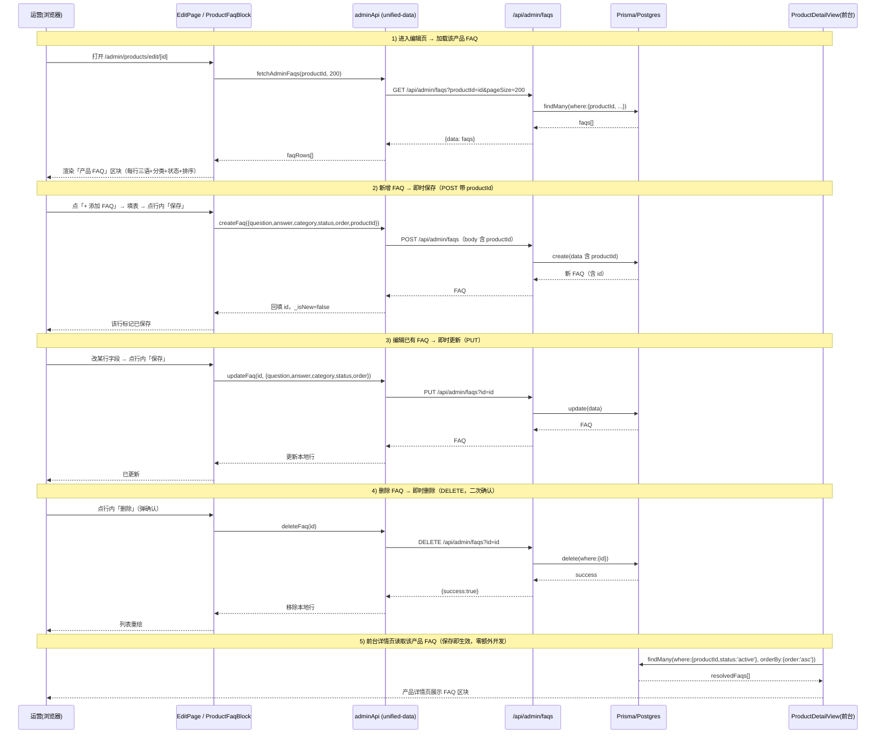
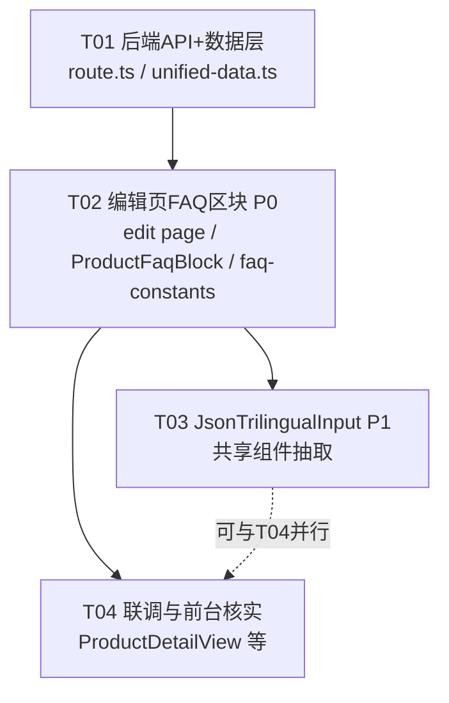

# 产品 FAQ 后台管理 — 系统架构设计 + 任务分解

> 作者：架构师 Bob（高见远）
> 项目：Smart Cabinet（Next.js 14 + Prisma + PostgreSQL + Tailwind）
> 输入：PRD `docs/product-faq-admin-prd.md`
> 目标：在 `admin/products` 编辑页新增「产品 FAQ」区块，运营对该产品增/删/改多条三语 FAQ，保存即前台生效。

---

## Part A：系统设计

### 1. 实现方案（Implementation Approach）

**技术难点**
- 现有后台 `adminApi.fetchAdminFaqs()` 不支持按 `productId` 过滤；`POST/PUT` 不处理 `productId`，导致 per-product FAQ 无法落入正确归属。
- 编辑页 `handleSubmit` 仅调 `updateProduct`，不触碰 FAQ；需新增独立区块，且按主理人决策采用「区块内每条 FAQ **独立即时保存/删除**」，不并入主提交按钮（降低耦合与风险）。
- 前台消费链路已就绪（见下），**后端改动即可让前台零额外开发生效**。

**框架/库选型**
- 沿用现有技术栈，**零新框架、零新 npm 包**：Next.js 14 App Router（Route Handler 写 API）、Prisma + PostgreSQL（数据层）、React 客户端组件 + Tailwind（UI）、`lucide-react`（图标，已存在）。
- 架构模式：保留现有「服务端 Route Handler + `adminApi` 客户端封装 + 客户端受控组件」分层；新增的「产品 FAQ」区块作为编辑页内的**本地受控子状态**（draft 行数组），逐条调用 `adminApi` 即时提交。

**关键代码事实（已读源码核实）**
- 数据层实际位置是 `src/data/unified-data.ts` 的 `adminApi` 对象（**不是** `src/lib/api.ts`）。编辑页与全局 add 页均 `import { adminApi } from '@/data/unified-data'`。`src/lib/api.ts` 中的 `createFAQ/updateFAQ/deleteFAQ` 用的是 `/api/admin/faqs/${id}` 路径写法，与现有单文件 `route.ts`（`?id=` 写法）**不一致**，不在本次范围；本设计只动 `adminApi`（unified-data）且保持 `?id=` 约定。
- `adminApi.updateFaq(id,data)` / `deleteFaq(id)` 已是 `PUT/DELETE /api/admin/faqs?id=id`，与 `route.ts` 完全匹配（全局无 `[id]/route.ts`）。
- 公开 `GET /api/faqs` 已支持 `productId` 过滤（带则返回该产品 active FAQ，不带则返回全局 `productId=null`）。
- 前台 `ProductDetailView.tsx`（server component）直接 `prisma.fAQ.findMany({ where:{ productId, status:'active' }, orderBy:{ order:'asc' } })` → `translate()` → `<ProductFaqSection>`，**保存即生效，本设计不改前台**。

---

### 2. 文件清单（File List）

| 动作 | 相对路径 | 说明 |
|------|----------|------|
| **改** | `src/app/api/admin/faqs/route.ts` | GET 加 `productId` 过滤；POST 持久化 `productId`；PUT 接收 `productId`；DELETE 复用 |
| **改** | `src/data/unified-data.ts` | `adminApi.fetchAdminFaqs(productId?, pageSize=200)` 扩展，透传 `productId`；`createFaq/updateFaq/deleteFaq` 已透传，无需改 |
| **改** | `src/app/admin/products/edit/[id]/page.tsx` | 在「SEO 关键词」区块后新增「产品 FAQ」区块；加载/回填该产品 FAQ；逐条保存/删除；空状态 |
| **新** | `src/components/admin/ProductFaqBlock.tsx` | 「产品 FAQ」区块组件（内联三语输入 + 逐条保存/删除 + 排序 + 状态 + 空状态），被编辑页引入 |
| **新** | `src/data/faq-constants.ts` | `FAQ_CATEGORIES` 11 个固定 category 枚举常量，区块与全局 add 页共用基础 |
| **新**（P1） | `src/components/admin/JsonTrilingualInput.tsx` | 三语 Json 输入共享组件（P1-5 抽取；P0 先内联，见任务 T03） |
| 改（P1） | `src/app/admin/faqs/add/page.tsx` | P1 用 `JsonTrilingualInput` 替换内联三语（与区块共用） |
| 只读核实 | `src/app/[locale]/products/[...slug]/ProductDetailView.tsx` | 确认保存即前台生效，无需改 |
| 只读核实 | `src/app/[locale]/products/[...slug]/ProductFaqSection.tsx` | 前台展示组件，无需改 |
| 只读核实 | `src/app/api/faqs/route.ts` | 已支持 `productId` 过滤，无需改 |
| 交付物 | `docs/product-faq-admin-design.md` | 本设计文档 |
| 交付物 | `docs/sequence-diagram.mermaid` / `docs/class-diagram.mermaid` | 抽取图 |

---

### 3. 数据结构与接口（Data Structures and Interfaces）

```mermaid
classDiagram
    class Product {
        +String id
        +String slug
        +String sku
        +Json name
        +String status
        +FAQ[] faqs
    }
    class FAQ {
        +String id
        +Json question  %% {zh,en,ar}
        +Json answer    %% {zh,en,ar}
        +String category
        +Int order
        +String status  %% per-product: active/draft
        +Boolean featured
        +DateTime createdAt
        +DateTime updatedAt
        +String productId  %% 可选 FK；null=全局 FAQ
    }
    class FAQAdminRoute {
        +GET(request)  %% 新增 productId 过滤
        +POST(request) %% 新增 productId 持久化
        +PUT(request)  %% 新增 productId 接收
        +DELETE(request) %% 按 ?id= 删除，复用
    }
    class AdminApiClient {
        +fetchAdminFaqs(productId?, pageSize)
        +createFaq(data)
        +updateFaq(id, data)
        +deleteFaq(id)
    }
    class ProductFaqBlock {
        -faqRows: FaqDraft[]
        +loadFaqs(productId)
        +addRow()
        +saveRow(row)
        +deleteRow(id)
        +moveRow(id, dir)
    }
    class FaqDraft {
        +String id
        +Json question
        +Json answer
        +String category
        +String status
        +Int order
        +Boolean _isNew
        +Boolean _saving
        +Boolean _deleting
    }

    Product "1" o-- "0..*" FAQ : productId 可选FK(onDelete Cascade)
    FAQAdminRoute ..> FAQ : prisma.fAQ CRUD
    AdminApiClient ..> FAQAdminRoute : HTTP /api/admin/faqs
    ProductFaqBlock ..> AdminApiClient : 调用
    ProductFaqBlock *-- FaqDraft : 维护本地 draft 列表
```

**后端最小改动点（行号级，文件 `src/app/api/admin/faqs/route.ts`）**

1. **GET 缺 `productId` 过滤**
   - 当前第 22–27 行读取 `page/pageSize/status/category/search`，**未读 `productId`**；第 31–72 行组装 `where`，**未设置 `where.productId`**。
   - 最小改动：在第 27 行后加 `const productId = searchParams.get('productId');`；在第 42 行（`category` 过滤块结束 `}`）后加：
     ```ts
     // v-product-faq：传入 productId 则只返回该产品 FAQ；不传维持返回全部以兼容全局管理页
     if (productId) where.productId = productId;
     ```
2. **POST `faqData` 漏 `productId`**
   - 当前第 122–129 行组装 `faqData`，**无 `productId`** → 新建 FAQ 永远 `productId=null`（变成全局 FAQ）。
   - 最小改动：在 `faqData` 对象内（如第 124 行 `answer: ...` 之后）加 `productId: body.productId ?? null,`。Prisma 允许直接写 FK 标量，无需 `connect`。
3. **PUT `updateData` 漏 `productId`**
   - 当前第 175–182 行逐个字段写入 `updateData`，**无 `productId`**。
   - 最小改动：在第 182 行后加 `if (body.productId !== undefined) updateData.productId = body.productId;`（前端通常不改归属，但后端需可接收）。
4. **DELETE**：第 202–236 行按 `?id=` 删除，已可直接复用，**无需改动**。

**前端数据层改动点（`src/data/unified-data.ts`）**
- `fetchAdminFaqs()`（第 567–572 行）扩展为 `fetchAdminFaqs(productId?: string, pageSize = 200)`，URL 追加 `?productId=xxx&pageSize=200`（productId 存在时）；返回 `json.data || []` 不变。
- `createFaq(data)`（574–584）、`updateFaq(id,data)`（586–596）、`deleteFaq(id)`（598–606）**已透传整包 data / `?id=`**，区块把 `productId` 放进 data 即可，**无需改这三处**。

---

### 4. 程序调用流程（Program Call Flow）



---

### 5. 待明确事项（Anything UNCLEAR）

- **归属不可变**：`productId` 在创建时绑定；PUT 虽接收 `productId`，但区块 UI 不暴露「改归属」操作（按主理人决策 Q4）。如需跨产品移动属 P2。
- **单产品 FAQ 数量上限**：默认读取 `pageSize=200`，假设单产品 FAQ < 200 条；超量需分页（P2）。
- **状态枚举不一致**：全局 add 页用 `active/inactive`，per-product 区块按决策 Q5 用 `active/draft`。两者各自独立，不在本次强制统一（属 P2 清理项）。
- **校验强度**：后端已校验 `question/answer` 必填；区块前端对新建行要求 `questionEn/answerEn` 非空（对齐全局 add 页）才允许保存，其余语言可空（AR 缺省回退 EN，与 add 页一致）。
- **公开 API 行为保留**：`/api/faqs` 不带 `productId` 时仍只返全局（`productId=null`），不受影响。

---

## Part B：任务分解（Task Decomposition）

### 6. 依赖包（Required Packages）

```
# 无新增依赖。全部复用现有：
# next@14, react, react-dom, @prisma/client, prisma, tailwindcss, lucide-react
```

### 7. 任务列表（有序、含依赖、按实现顺序）

| Task | 名称 | 源文件（动作） | 依赖 | 优先级 | 验收点 |
|------|------|----------------|------|--------|--------|
| **T01** | 后端 API + 数据层改造（P0 核心，无新表/新端点） | `src/app/api/admin/faqs/route.ts`（GET 加 productId 过滤 L27/42；POST 持久化 productId L124；PUT 接收 productId L182）；`src/data/unified-data.ts`（`fetchAdminFaqs(productId?,200)` L567）；`src/app/api/faqs/route.ts`（只读核实，不改） | 无 | **P0** | ① `GET /api/admin/faqs?productId=X` 仅返回该产品 FAQ，不带则仍返全部；② `POST` 带 `productId` 入库后该条 `productId=X`；③ `PUT` 可接收 `productId`；④ DELETE 沿用 |
| **T02** | 编辑页「产品 FAQ」区块（P0 内联实现，覆盖 排序/状态/校验/空状态） | `src/app/admin/products/edit/[id]/page.tsx`（引入区块、useEffect 加载 FAQ 回填）；`src/components/admin/ProductFaqBlock.tsx`（新：本地 `faqRows` 状态、内联三语、逐条保存/删除、排序数字+上移/下移、状态 active/draft、空状态引导）；`src/data/faq-constants.ts`（新：`FAQ_CATEGORIES` 11 枚举） | T01 | **P0** | ① 进入编辑页加载该产品 FAQ 回填；② 「+ 添加 FAQ」新增草稿行；③ 行内「保存」= 新行 POST(带 productId) / 旧行 PUT；④ 「删除」二次确认后 DELETE；⑤ 排序输入+上下移生效；⑥ 状态 active/draft；⑦ 该产品无 FAQ 显示引导文案；⑧ 不与主「更新产品」按钮耦合 |
| **T03** | 共享三语输入组件抽取 `JsonTrilingualInput`（P1-5 关键项） | `src/components/admin/JsonTrilingualInput.tsx`（新：三语 Json 输入，AR `dir="rtl"`）；`src/app/admin/faqs/add/page.tsx`（改：替换内联三语为组件）；`src/components/admin/ProductFaqBlock.tsx`（改：复用组件替换内联三语） | T02 | **P1** | ① 全局 add 页与产品区块共用同一三语组件；② 字段结构/AR 右向一致；③ 不改既有行为 |
| **T04** | 联调与前台消费链路核实（P0 生效验证 + P2 延后项记录） | `src/app/[locale]/products/[...slug]/ProductDetailView.tsx`（只读核实：直连 DB 读 per-product active FAQ）；`src/app/[locale]/products/[...slug]/ProductFaqSection.tsx`（只读核实）；`src/app/api/faqs/route.ts`（只读核实 productId 过滤） | T02（可与 T03 并行） | **P0**（验证）/ **P2**（延后项） | ① 后台保存一条 per-product FAQ 后，前台该产品详情页立即出现；② status=draft 不前台展示；③ 记录 P2 延后项（跨产品移动、>200 分页、全局/产品状态枚举统一、富文本答案） |

> 覆盖说明：P0 全量 7 项 = API 复用(✅T01)、后端 GET/POST/PUT 改造(✅T01)、内联三语(✅T02)、独立即时保存/删除(✅T02)、status active/draft(✅T02)、order 排序(✅T02)、category 11 枚举(✅T02/faq-constants)；P1 关键项 = 排序/状态/校验/空状态(✅T02) + 组件抽取(✅T03)；P2 延后(✅T04 记录)。

### 8. 共享知识（Shared Knowledge / 跨文件约定）

- **FAQ 字段契约**：`id, question{zh,en,ar}, answer{zh,en,ar}, category, order:Int, status, featured:Bool, productId?, createdAt, updatedAt`（`prisma/schema.prisma` FAQ 模型 L114–133）。
- **`productId` 语义**：`null` = 全局 FAQ（16 条）；= 产品 id = 该产品的 per-product FAQ。表已建 `@@index([productId])`。
- **`status` 可见性**：仅 `active` 前台可见；`ProductDetailView` 仅查 `status:'active'`。per-product 区块用 `active/draft`。
- **三语 Json 结构**：`{ zh, en, ar }`；阿拉伯语输入框 `dir="rtl"`；AR 缺省回退 EN（add 页 L40–41）。
- **category 11 枚举**（来自全局 add 页 L63–75）：features / security / tracking / reporting / integration / products / customization / applications / sales / support / company。
- **保存时机契约**：区块内每条 FAQ **独立即时保存/删除**（POST/PUT/DELETE），**不**并入主「更新产品」`updateProduct` 提交。
- **全局管理页兼容**：`/api/admin/faqs` 不带 `productId` 仍返回全部（兼容现有全局 FAQ 列表页）；公开 `/api/faqs` 带 `productId` 返回该产品 active，不带返回全局 `productId=null`。
- **数据层入口**：前端统一走 `adminApi`（`src/data/unified-data.ts`），URI 约定 `?id=`；勿用 `src/lib/api.ts` 的 `createFAQ` 等（路径写法不一致）。

### 9. 任务依赖图（Task Dependency Graph）


