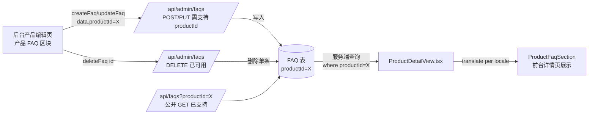

# 简单 PRD：后台单产品 FAQ 管理（product_faq_admin）

> 作者：许清楚 / Xu（产品经理）　|　版本：v1（简单 PRD）　|　关联：Smart Cabinet v265 per-product FAQ

---

## 一、项目信息

| 项 | 内容 |
|---|---|
| 语言 (Language) | 中文 (zh) |
| 技术栈 (Programming Language) | Next.js (App Router) + React + Tailwind CSS（**已核实实际项目栈**，覆盖默认 Vite 模板） |
| 项目名称 (Project Name) | `product_faq_admin` |
| 原始需求复述 | 后台「产品编辑页」需新增「产品 FAQ」区块，运营可对**单个产品**增 / 删 / 改多条 FAQ（每条含三语 question/answer），保存时带 `productId` 写入 `FAQ` 表，与全局 FAQ（`productId=null`）解耦。公共 FAQ 页保持 16 条全局 FAQ 不变。 |

---

## 二、代码核查结论（已读实际代码，非推测）

| 核查项 | 路径 / 位置 | 结论 |
|---|---|---|
| FAQ 模型字段 | `prisma/schema.prisma` L114–133 | ✅ `id` / `question`(Json{zh,en,ar}) / `answer`(Json{zh,en,ar}) / `category` / `order`(默认0) / `status`(默认active) / `featured` / `createdAt` / `updatedAt` / `productId?`(FK→Product, `onDelete: Cascade`，已建索引)。三语 Json 结构与全局 FAQ 完全一致。 |
| 前台消费方式 | `src/app/[locale]/products/[...slug]/ProductDetailView.tsx` L165–173 | ✅ 服务端查询 `prisma.fAQ.findMany({ where: { productId, status:'active' }, orderBy:{order:'asc'} })`，经 `translate()` 解析后传给 `ProductFaqSection`。**该产品详情页已能展示 per-product FAQ，保存即前台生效。** |
| 前台展示组件 | `ProductFaqSection.tsx` | ✅ 可折叠 `<details>` 列表，接收 `{question, answer, category}[]`；无数据则渲染 `null`。 |
| 后台产品编辑页结构 | `src/app/admin/products/edit/[id]/page.tsx` | ⚠️ 现有区块：**基本信息 / 分类 / 标签 / 图片 / 描述 / 功能特点 / 参数配置 / SEO 关键词**。**无 FAQ 区块**；`handleSubmit` 仅调用 `adminApi.updateProduct`，不触碰 FAQ。区块样式为「白卡片 + 左侧色条标题」，可直接套用。 |
| 全局 FAQ 管理页 | `src/app/admin/faqs/{page,add,edit/[id]}` | ⚠️ `add` 页用三语输入框（questionZh/En/Ar、answerZh/En/Ar）+ category 固定枚举(11项) + status(active/inactive)。**并非独立可复用组件，是内联 JSX**，建议提取为共享控件。 |
| 后台 FAQ API | `src/app/api/admin/faqs/route.ts` | ⚠️ **关键缺口**：GET 支持 status/category/search 过滤，但**未支持 `productId` 过滤**（会混出全局与 per-product）；POST 创建时 `faqData` **遗漏 `productId`**（无法创建 per-product FAQ）；PUT 更新 `updateData` **未处理 `productId`**；DELETE 按 id 删除 ✅（可直接复用）。 |
| 公开 FAQ API | `src/app/api/faqs/route.ts` | ✅ GET 已支持 `productId` 过滤：传 `productId` 返回该产品 active FAQ（order 升序）；不传则返回全局 `productId=null`。前台读取链路已就绪。 |

**阻塞 P0 的后端改造**：`/api/admin/faqs` 的 **POST / PUT 必须支持并持久化 `productId`**；**GET 需支持 `productId` 过滤**（用于后台区块加载该产品已有 FAQ）。DELETE 已可直接复用。

---

## 三、产品目标（Product Goals）

1. **一站式管理**：运营能在产品编辑页内直接完成「该产品 FAQ 的增 / 删 / 改」，无需离开页面或切换到全局 FAQ 管理。
2. **零冗余共存**：per-product FAQ 与全局 FAQ 共用同一张 `FAQ` 表与同一套 API，仅以 `productId` 有无区分，不引入新表/新模型。
3. **保存即生效**：写入后前台该产品详情页立刻展示（`status=active` 才可见，`order` 控制顺序），无需额外发布步骤。

---

## 四、用户故事（User Stories）

- 作为**运营**，我想在产品编辑页直接为该产品添加 FAQ（三语），以便客户在详情页看到精准答疑。
- 作为**运营**，我想编辑 / 删除某条产品 FAQ，以便更正错误或下架过期内容。
- 作为**运营**，我想调整 FAQ 的展示顺序与启停状态，以便控制前台呈现与可见性。
- 作为**运营**，当某产品还没有 FAQ 时，我想看到清晰的空状态引导，以便快速上手。

---

## 五、需求池（P0 / P1 / P2）

### P0（Must have — 必须有）

| 编号 | 需求 | 验收标准 |
|---|---|---|
| P0-1 | 后台产品编辑页新增「产品 FAQ」区块 | 区块位于现有区块之后（建议 SEO 关键词之后）；标题沿用左侧色条卡片风格，保证视觉统一 |
| P0-2 | 支持对该产品「新增多条 FAQ」 | 点击「+ 添加 FAQ」新增一条草稿行；可同时存在多条；每条含 question(三语)+answer(三语)+category+status |
| P0-3 | 三语输入复用全局 FAQ 表单模式 | 复用 questionZh/En/Ar、answerZh/En/Ar 三语输入框（AR 输入框 `dir=rtl`）；建议提取为共享组件 `JsonTrilingualInput`（见 P1-5），P0 阶段可先内联复用相同结构 |
| P0-4 | 保存时带 `productId` 写入 FAQ 表 | 调用 `adminApi.createFaq(data)` 时 `data.productId = 当前产品id`；**后端 `/api/admin/faqs` POST 需支持并持久化 `productId`（开发项）** |
| P0-5 | 支持编辑已有 FAQ | 调用 `adminApi.updateFaq(id, data)`，`data` 可含 `productId`（防止误改归属到其他产品） |
| P0-6 | 支持删除单条 FAQ | 调用 `adminApi.deleteFaq(id)`；二次确认弹窗；删除后列表实时移除 |
| P0-7 | 后台 API 改造（阻塞项） | POST/PUT 支持 `productId` 字段；GET 支持 `productId` 过滤（传 `productId` 仅返回该产品；不传维持现有「返回全部」行为以兼容全局管理页） |

### P1（Should have — 应该有）

| 编号 | 需求 | 验收标准 |
|---|---|---|
| P1-1 | 排序控制 | 每条 FAQ 可设 `order`（数字输入或上移/下移按钮），前台按 `order` 升序展示 |
| P1-2 | 状态控制 | `status=active` 才在前台展示；新建默认 `active`；枚举对齐 schema 用 `active/draft`（全局 admin 现有 `inactive` 需改为 `draft`，确保与公开 API `status:'active'` 过滤一致） |
| P1-3 | 表单校验 | 至少 en + zh 的 question/answer 必填；提交前置校验并高亮错误项 |
| P1-4 | 空状态提示 | 该产品无 FAQ 时显示引导文案「暂无产品 FAQ，点击添加第一条」 |
| P1-5 | 提取共享三语输入组件 | 从 `admin/faqs/add` 抽取 `JsonTrilingualInput`，后台两个入口复用，消除重复代码 |
| P1-6 | 加载已有 FAQ | 进入编辑页时按 `productId` 拉取该产品 FAQ 并回填表单（依赖 P0-7 的 GET 改造） |

### P2（Nice to have — 可以有）

| 编号 | 需求 | 验收标准 |
|---|---|---|
| P2-1 | 批量导入 FAQ | 支持从 Excel / JSON 批量导入某产品 FAQ |
| P2-2 | FAQ 模板 / 复用 | 将常用 FAQ 存为模板，一键套用到其他产品 |
| P2-3 | 拖拽排序 | 区块内拖拽调整 FAQ 顺序（替代手动 `order` 输入） |

---

## 六、UI 设计稿（后台产品编辑页 ·「产品 FAQ」区块）

```
┌─────────────────────────────────────────────────────────────┐
│ 编辑产品                                                     │
├─────────────────────────────────────────────────────────────┤
│  （上方：基本信息 / 分类 / 标签 / 图片 / 描述 / 功能特点 /    │
│   参数配置 / SEO 关键词  …… 现有区块，保持不变）              │
├─────────────────────────────────────────────────────────────┤
│ ▌ 产品 FAQ  (3)                          [ + 添加 FAQ ]      │  ← 新增区块
│ ┌───────────────────────────────────────────────────────┐  │
│ │ FAQ #1  [category ▾] [status ▾]            [✎][🗑]      │  │
│ │  问题(中)* [________________]  问题(EN)* [______________] │  │
│ │  问题(AR) [________________](rtl)                        │  │
│ │  答案(中)* [________________]  答案(EN)* [______________] │  │
│ │  答案(AR) [________________](rtl)         顺序[ 0 ]     │  │
│ └───────────────────────────────────────────────────────┘  │
│ ┌───────────────────────────────────────────────────────┐  │
│ │ FAQ #2  ...                                             │  │
│ └───────────────────────────────────────────────────────┘  │
│ （空状态：暂无产品 FAQ，点击「+ 添加 FAQ」）                  │  │
├─────────────────────────────────────────────────────────────┤
│                              [ 取消 ]   [ 更新产品 ]         │
└─────────────────────────────────────────────────────────────┘
```

> 区块内每条 FAQ 为可折叠 / 可删除的卡片；「更新产品」主按钮提交产品主体，`save` 时同步把 FAQ 列表（含 `productId`）写入 FAQ 表（P0 阶段可设计为：区块内每条独立「保存」或随主提交一并提交，见待确认问题）。

---

## 七、数据流（保存 → 前台展示）



> 与全局 FAQ 的关系：同一 `FAQ` 表 + 同一套 `/api/admin/faqs` 与 `/api/faqs`。仅以 `productId` 区分——`productId=null` 为全局 FAQ（由 `/admin/faqs` 管理）；`productId=某产品` 为该产品 FAQ（由产品编辑页新区块管理）。删除产品时 `onDelete: Cascade` 自动清理其 FAQ。

---

## 八、待确认问题（已给默认决策）

| # | 问题 | 默认决策 |
|---|---|---|
| Q1 | 三语输入控件是否现成可复用组件？ | 全局 `add` 页为内联 JSX，无独立组件；默认：P0 先复用相同结构内联，P1-5 提取 `JsonTrilingualInput` 共享，**不阻塞 P0** |
| Q2 | 保存走哪个 API？ | 复用 `/api/admin/faqs`，POST/PUT 补 `productId` 参数（需后端改造，见 P0-7） |
| Q3 | 若无 per-product 端点怎么办？ | **不新增独立端点**，扩展现有 `/api/admin/faqs` 支持 `productId`（GET 过滤 + POST/PUT 持久化），保持单一入口 |
| Q4 | 与产品主体是否一并提交？ | 默认：每条 FAQ 在区块内独立「保存/删除」（即时写库），降低与 `updateProduct` 的耦合；也可随主提交批量保存（待架构师定） |
| Q5 | `status` 枚举取值？ | 复用 `active/draft`；仅 `active` 在前台展示（与公开 API 一致）。全局 admin 现有 `inactive` 需对齐为 `draft` |
| Q6 | `order` 如何设置？ | 默认递增 / 数字输入；提供上移下移；前台 `order` 升序 |
| Q7 | `category` 枚举？ | 复用全局 FAQ 的 11 个固定 category 选项 |

---

## 九、范围之外（Out of Scope）

- 公共 FAQ 页（`/api/faqs` 过滤 `productId=null` 的 16 条全局 FAQ）保持不变。
- 不改动 `FAQ` 数据模型（字段已齐备）。
- 不新增独立的产品 FAQ 后端服务 / 表。
